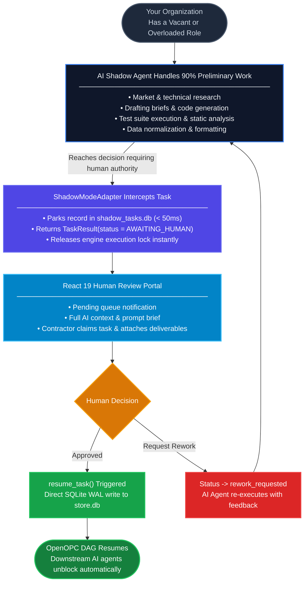
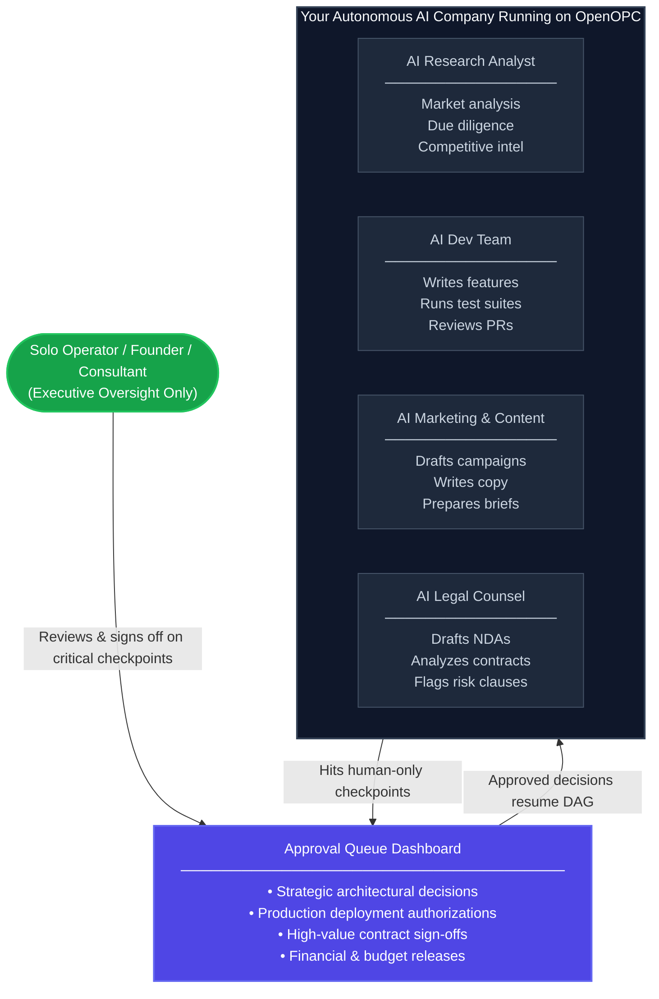
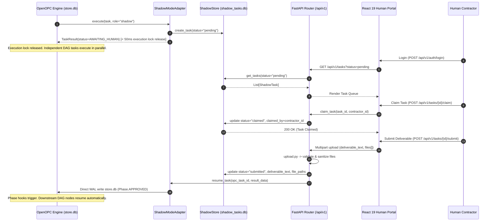
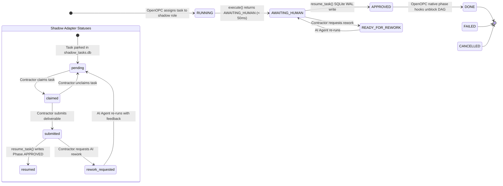

<!-- ============================================================
  ██████╗  █████╗  ██████╗    ███████╗██████╗ ███████╗ ██████╗
  ██╔══██╗██╔══██╗██╔════╝    ██╔════╝██╔══██╗██╔════╝██╔════╝
  ██║  ██║███████║██║  ███╗   ███████╗██████╔╝█████╗  ██║
  ██║  ██║██╔══██║██║   ██║   ╚════██║██╔═══╝ ██╔══╝  ██║
  ██████╔╝██║  ██║╚██████╔╝   ███████║██║     ███████╗╚██████╗
  ╚═════╝ ╚═╝  ╚═╝ ╚═════╝    ╚══════╝╚═╝     ╚══════╝ ╚═════╝

  AI AGENT — IMPLEMENTATION SPECIFICATION
  ═══════════════════════════════════════════════════════════════
  ARCHITECTURE CONTRACT
  ──────────────────────────────────────────────────────────────
  Base Class  : opc.layer3_agent.adapters.base.ExternalAgentAdapter
  Registry    : ADAPTER_CLASSES["shadow"] = ShadowModeAdapter
  execute()   : MUST return TaskResult(AWAITING_HUMAN) in < 100ms
                MUST NOT hold the calling execution thread
  resume_task(): MUST write Phase.APPROVED to OpenOPC store.db
                 MUST use SQLite WAL mode for concurrent-safe access

  PHASE TRANSITION CONTRACT
  ──────────────────────────────────────────────────────────────
  RUNNING          -> AWAITING_HUMAN    via execute() return value
  AWAITING_HUMAN   -> APPROVED          via resume_task() WAL write
  AWAITING_HUMAN   -> READY_FOR_REWORK  via contractor rework request
  READY_FOR_REWORK -> AWAITING_HUMAN    via AI agent re-run
  APPROVED         -> DONE              via OpenOPC native phase hooks

  IMPLEMENTATION CHECKLIST
  ──────────────────────────────────────────────────────────────
  [x] shadow_adapter/adapter.py      - ShadowModeAdapter class
  [x] shadow_adapter/api/app.py      - FastAPI application & shadow-serve CLI
  [x] shadow_adapter/api/routes_*.py - Versioned /api/v1 REST endpoints
  [x] shadow_adapter/models.py       - Pydantic v2 models: ShadowTask, ShadowContractor
  [x] shadow_adapter/security.py     - JWT issuance + bcrypt verification
  [x] shadow_adapter/shadow_store.py - SQLite WAL repository for shadow_tasks.db
  [x] shadow_adapter/upload.py       - File validation: max 5 files, 10MB each, 50MB total
  [x] shadow_adapter/exceptions.py   - Domain exceptions for N-Tier separation
  [x] shadow_adapter/frontend/       - React 19 + Tailwind SPA (dist/ pre-built)
  [x] tests/test_adapter.py          - Unit tests: execute() < 50ms, state transitions
  [x] tests/test_api.py              - Integration tests: all REST endpoints
  [x] tests/test_shadow_store.py     - WAL concurrency tests with mock store.db
  [x] pyproject.toml                 - Package metadata & 20 SEO keywords
  [x] example_usage.py               - Full demo: park -> submit -> resume in < 500ms
  ============================================================ -->

<div align="center">

# openopc-shadow-adapter

### Human-in-the-Loop (HITL) Execution Layer for the OpenOPC Multi-Agent DAG Runtime

**The non-blocking bridge connecting autonomous AI agent workflows with real-world human approvals.**

[](https://pypi.org/project/openopc-shadow-adapter/)
[](https://pypi.org/project/openopc-shadow-adapter/)
[](LICENSE)

[](https://fastapi.tiangolo.com)
[](https://github.com/AhmadHassan-BTed/OpenOPC-Shadow-Adapter)
[](https://www.sqlite.org/wal.html)
[](https://jwt.io)
[](https://github.com/AhmadHassan-BTed/OpenOPC-Shadow-Adapter)
[](https://github.com/HKUDS/OpenOPC)

<br/>

> Built for [OpenOPC](https://github.com/HKUDS/OpenOPC) | Zero Core Modifications | Production Release v0.1.0

</div>

---

## Core Philosophy & Product Vision

OpenOPC allows organizations to deploy automated teams of AI agents that plan, delegate, execute, and review work autonomously — orchestrated through a **dependency DAG** where independent tasks run in parallel and dependent tasks wait for their prerequisites.

This is extraordinary for anything a machine can do at machine speed: research, coding, drafting, testing, formatting, analysis.

But every real business reaches a moment where **a human must step in.** A lawyer signs a contract. A senior engineer approves a production deploy. A compliance officer clears a risk assessment. A creative director greenlights a campaign.

**The Problem:** OpenOPC runs on millisecond-to-minute timescales. The moment you try to pause and wait for a human operating on a *human* timescale — hours or days — **the 900-second execution lock expires and the entire DAG crashes.**

**The Solution:** `openopc-shadow-adapter` is the production-safe bridge. It **intercepts** tasks routed to human-backed roles, **parks** them in an isolated state store, and immediately **releases** the execution thread — so the rest of your AI company keeps working. When the human contractor logs into the **React Human Portal**, reviews the brief, and submits their deliverable, the adapter **resumes the DAG automatically** via a direct write to OpenOPC's phase store.

> **Your AI company runs itself. You — or your contractors — only touch the decisions that truly require a human.**

---

## Executive Summary

### The 4-Step Shadow Pipeline

1. **Intercepts Safely:** When an AI workflow reaches a human approval step, the adapter saves the task to an isolated database in less than 50 milliseconds.
2. **Releases Execution:** It frees the AI system immediately so all other non-dependent AI tasks continue running without interruption.
3. **Notifies Humans:** The human reviewer receives the assignment in a web portal, reviews the full context generated by the AI, and submits their decision.
4. **Resumes Automatically:** The moment the human approves, the adapter wakes up the AI system, and execution continues automatically.

---

## High-Level Architecture Overview

```mermaid
flowchart LR
    subgraph Engine ["OpenOPC Agentic DAG Engine"]
        DAG["Multi-Agent DAG Execution\n(Tasks running in parallel)"]
    end

    subgraph Adapter ["Shadow Mode Plugin"]
        SA["ShadowModeAdapter\n(execute < 50ms)"]
    end

    subgraph Store ["Isolated Persistence Layer"]
        DB[("SQLite WAL Store\nshadow_tasks.db")]
    end

    subgraph Portal ["Human Operations"]
        ReactApp["React 19 Human Portal\n(JWT Authenticated Queue)"]
        HumanReviewer["Human Contractor / Manager"]
    end

    subgraph ResumeLayer ["DAG Unblock & Resume"]
        OPCStore[("OpenOPC Engine Store\nstore.db (WAL Mode)")]
        UnblockNode(["Downstream DAG Nodes\nResume Automatically"])
    end

    DAG -->|1. Intercepts human-backed task| SA
    SA -->|2. Parks task record| DB
    SA -->|3. Returns AWAITING_HUMAN\nReleases thread immediately| DAG
    DB <-->|4. Fetch queue & Submit deliverable| ReactApp
    HumanReviewer <-->|5. Review brief & attach files| ReactApp
    ReactApp -->|6. POST /api/v1/tasks/{id}/submit| SA
    SA -->|7. resume_task(): Write Phase.APPROVED| OPCStore
    OPCStore -->|8. Native Phase Hooks Trigger| UnblockNode

    style DAG fill:#0c111b,color:#f8fafc,stroke:#3b82f6,stroke-width:2px
    style SA fill:#4f46e5,color:#ffffff,stroke:#6366f1,stroke-width:2px
    style DB fill:#0f172a,color:#e2e8f0,stroke:#64748b,stroke-width:2px
    style ReactApp fill:#0284c7,color:#ffffff,stroke:#38bdf8,stroke-width:2px
    style HumanReviewer fill:#059669,color:#ffffff,stroke:#10b981,stroke-width:2px
    style OPCStore fill:#0f172a,color:#e2e8f0,stroke:#64748b,stroke-width:2px
    style UnblockNode fill:#16a34a,color:#ffffff,stroke:#22c55e,stroke-width:2px
```

---

## System Capabilities & Comparison

| Scenario | Standard OpenOPC | OpenOPC + Shadow Adapter |
|:---|:---|:---|
| **Human response under 60 seconds** | Supported | Supported |
| **Human response taking hours or days** | System failure (900s timeout crash) | Supported (zero timeouts) |
| **System restart while waiting** | State lost | State persisted in isolated SQLite database |
| **Multiple human reviewers** | Single local user only | Multi-user queue with role-based access |
| **Contractor file attachments** | Text only | Supported (up to 5 files, 50MB payload) |
| **Compliance audit trail** | Basic log | Immutable event timeline with user attribution |
| **Rework loop** | Manual intervention required | Built-in request-for-rework phase transition |

---

## Primary Operational Use Cases

### Use Case 1 — Automate Roles in Your Existing Organization

> *You lost a developer. Your legal reviewer is on leave. Your analyst is at capacity.*  
> **Don't halt operations. Deploy the adapter.**



**Real-world application:**

- **Lost your senior developer?** AI writes, reviews, and tests code. Shadow Adapter routes production deploys and architecture decisions to a remaining engineer for approval only.
- **Need legal coverage?** AI drafts contracts and flags risk clauses. Shadow Adapter sends the final document to your counsel for sign-off.
- **Scaling a content operation?** AI researches, drafts, and formats every piece. Shadow Adapter queues each one for an editor's final approval before publishing.
- **Financial analysis pipeline?** AI builds models and writes memos. Shadow Adapter routes investment committee decisions to your analysts for approval.

---

### Use Case 2 — Run Your Entire Company on AI Autopilot

> *One person. The output of a 10-person team.*  
> **You oversee. The AI executes. The adapter bridges the gap.**



**What this means in practice:**

- Your **AI Research Analyst** runs market analysis, competitor mapping, and due diligence 24/7 across dozens of projects simultaneously.
- Your **AI Dev Team** writes features, runs tests, and reviews PRs — you only approve production deployments and architectural pivots.
- Your **AI Legal Counsel** drafts all contracts and NDAs — you spend 10 minutes reviewing rather than 4 hours drafting.
- The **Shadow Adapter** is the invisible infrastructure that makes all of this safe, audit-compliant, and crash-proof.

---

### Use Case 3 — Enterprise Compliance & Regulated Industry Workflows

For teams building AI automation in **finance, legal, healthcare, or security**, regulatory requirements mandate human sign-off at defined workflow stages. Shadow Adapter makes compliance a **first-class architectural feature** — not an afterthought patched onto an autonomous pipeline.

The adapter's immutable audit log records every lifecycle event with timestamps and contractor attribution, satisfying SOC 2, ISO 27001, and GDPR review requirements for human oversight in automated decision systems.

---

## Technical Lifecycle & Sequence



---

## State Machine Integration

The adapter integrates directly into OpenOPC's native `Phase` state machine without modifying host source code:



---

## System Architecture

```mermaid
flowchart TD
    subgraph HostEnv ["OpenOPC Framework Environment (HKUDS/OpenOPC)"]
        direction LR
        EngineCore["OpenOPC DAG Engine\n(opc.core.engine)"]
        Registry["Adapter Registry\nADAPTER_CLASSES['shadow']"]
        ConfigYaml["Organization Config\n(company_config.yaml)"]
        OPCStore[("OpenOPC Store DB\n(store.db - SQLite WAL Mode)")]
    end

    subgraph ShadowPackage ["openopc-shadow-adapter Package"]
        AdapterImpl["ShadowModeAdapter (adapter.py)\nSubclasses ExternalAgentAdapter\n• execute() -> TaskResult(AWAITING_HUMAN)\n• resume_task() -> Direct WAL Write"]
        
        subgraph APILayer ["FastAPI REST Application (shadow_adapter/api)"]
            AppFactory["App Factory & Server (app.py)\nCLI Entry Point: shadow-serve"]
            AuthRoutes["Auth Router (routes_auth.py)\n/api/v1/auth/login\n/api/v1/auth/register"]
            TaskRoutes["Tasks Router (routes_tasks.py)\n/api/v1/tasks\n/api/v1/tasks/{id}/claim\n/api/v1/tasks/{id}/submit"]
            UploadSecurity["Security & Upload Engine (upload.py)\nFile limit: 5 files, 10MB each, 50MB total\nExtension allowlist & path sanitization"]
        end

        StoreRepo["ShadowStore Repository (shadow_store.py)\nThread-safe SQLite WAL Access"]
        ShadowDB[("Shadow Database\n(shadow_tasks.db)\n• shadow_tasks\n• audit_log\n• contractors")]
        
        FrontendSPA["React 19 SPA (shadow_adapter/frontend/dist)\n• JWT Authentication\n• Task Queue Dashboard\n• Deliverable Upload Dropzone\n• Audit Timeline Viewer"]
    end

    ClientBrowser(["Human Contractor / Manager\n(Web Browser)"])

    ConfigYaml -->|Configures shadow preferred agent| Registry
    Registry -->|Instantiates| AdapterImpl
    EngineCore -->|Invokes execute()| AdapterImpl
    AdapterImpl -->|1. Park task| StoreRepo
    StoreRepo --> ShadowDB
    AdapterImpl -->|2. Write Phase.APPROVED| OPCStore
    OPCStore -->|Native Phase Hooks| EngineCore

    ClientBrowser <-->|HTTP / HTTPS| FrontendSPA
    FrontendSPA <-->|REST API + JWT| AppFactory
    AppFactory --> AuthRoutes
    AppFactory --> TaskRoutes
    TaskRoutes --> UploadSecurity
    TaskRoutes --> StoreRepo
    StoreRepo <--> ShadowDB

    style HostEnv fill:#0c111b,color:#f8fafc,stroke:#3b82f6,stroke-width:2px
    style ShadowPackage fill:#0f172a,color:#f8fafc,stroke:#6366f1,stroke-width:2px
    style AdapterImpl fill:#4f46e5,color:#ffffff,stroke:#6366f1,stroke-width:2px
    style AppFactory fill:#0284c7,color:#ffffff,stroke:#38bdf8,stroke-width:2px
    style ShadowDB fill:#1e293b,color:#f8fafc,stroke:#64748b,stroke-width:2px
    style OPCStore fill:#1e293b,color:#f8fafc,stroke:#64748b,stroke-width:2px
    style FrontendSPA fill:#059669,color:#ffffff,stroke:#10b981,stroke-width:2px
    style ClientBrowser fill:#16a34a,color:#ffffff,stroke:#22c55e,stroke-width:2px
```

---

## Quick Start Guide

### 1. Installation

Install via `pip`:

```bash
pip install openopc-shadow-adapter
```

Or using `uv`:

```bash
uv pip install openopc-shadow-adapter
```

### 2. Environment Configuration

Create a `.env` file in your root working directory:

```env
SHADOW_JWT_SECRET=specify-a-secure-secret-key-with-minimum-32-characters
SHADOW_DB_PATH=./shadow_tasks.db
SHADOW_OPC_STORE_PATH=.opc/projects/default/store.db
SHADOW_UPLOAD_DIR=./shadow_uploads
SHADOW_API_PORT=8800
```

### 3. Adapter Registration

Register the adapter in your application initialization code **before** starting the OpenOPC engine:

```python
from opc.layer3_agent.adapters.registry import ADAPTER_CLASSES
from shadow_adapter.adapter import ShadowModeAdapter

# Register Shadow Mode into OpenOPC's adapter registry
ADAPTER_CLASSES["shadow"] = ShadowModeAdapter
```

### 4. Assign Shadow Roles in Organization Config

Configure target roles to use the `shadow` adapter in your OpenOPC organization YAML file:

```yaml
# .opc/config/company_orgs/company_config.yaml
roles:
  legal_counsel:
    title: "Human Legal Counsel"
    execution_strategy: external
    preferred_external_agent: shadow

  senior_architect:
    title: "Human Senior Architect"
    execution_strategy: external
    preferred_external_agent: shadow
```

### 5. Launch Server

Start the REST API server and React Human Web Portal:

```bash
shadow-serve --port 8800
```

- **Human Web Portal:** `http://localhost:8800`
- **REST API Base:** `http://localhost:8800/api/v1`
- **Health Endpoint:** `http://localhost:8800/api/v1/health`

---

## Technical Specifications

### Feature Matrix

| Feature | Implementation | Engineering Rationale |
|:---|:---|:---|
| **Zero Core Modifications** | Extends `ExternalAgentAdapter` via `ADAPTER_CLASSES` | Clean separation of concerns; immune to breaking upstream OpenOPC releases |
| **Non-Blocking Intercept** | `execute()` returns `TaskResult` in under 50ms | Prevents engine thread starvation and bypasses the 900s timeout |
| **Isolated Persistence** | Standalone `shadow_tasks.db` SQLite database | Preserves task state independently of host engine lifecycles |
| **WAL-Mode Resume Pipeline** | Concurrent writes via `aiosqlite` WAL connection | Allows safe concurrent database access between live OpenOPC engine and API server |
| **Role-Based Access Control** | JWT authentication + bcrypt password hashing | Ensures review tasks are restricted to authorized human contractors |
| **Upload Security Controls** | Path sanitization, extension allowlist, payload limits | Enforces maximum 5 files, 10MB per file, 50MB total payload to prevent server abuse |
| **Immutable Audit Logging** | Trigger-backed `audit_log` table | Tracks all lifecycle transitions (`parked`, `claimed`, `submitted`, `resumed`) for compliance verification |

---

## API Endpoint Reference

All authenticated endpoints require an `Authorization: Bearer <jwt_token>` header.

### Authentication Endpoints

| Endpoint | Method | Access | Request Payload | Response |
|:---|:---|:---|:---|:---|
| `/api/v1/auth/register` | `POST` | Admin / Initial* | `{username, password, email}` | `ContractorPublic` object |
| `/api/v1/auth/login` | `POST` | Public | `{username, password}` | `{access_token, token_type, contractor}` |
| `/api/v1/auth/me` | `GET` | Authenticated | None | `ContractorPublic` profile |

*\*Note: The first user registered automatically receives the `admin` role.*

### Task Management Endpoints

| Endpoint | Method | Access | Parameters / Payload | Description |
|:---|:---|:---|:---|:---|
| `/api/v1/tasks` | `GET` | Authenticated | `?status=pending&assigned_to_me=true` | Query parked tasks with optional filtering |
| `/api/v1/tasks/{id}` | `GET` | Authenticated | None | Retrieve complete task record, AI context, and brief |
| `/api/v1/tasks/{id}/claim` | `POST` | Authenticated | None | Claim a pending task for the active contractor |
| `/api/v1/tasks/{id}/unclaim` | `POST` | Authenticated | None | Release a claimed task back to the pending queue |
| `/api/v1/tasks/{id}/submit` | `POST` | Authenticated | Multipart (`deliverable_text`, `files[]`) | Submit deliverable and trigger OpenOPC DAG resume |
| `/api/v1/tasks/{id}/audit` | `GET` | Authenticated | None | Retrieve full audit trail for the task |
| `/api/v1/health` | `GET` | Public | None | Server health status and pending task count |

---

## Configuration Variable Reference

| Variable | Default Value | Required | Description |
|:---|:---|:---|:---|
| `SHADOW_JWT_SECRET` | None | **Yes** | Secret key for signing JWT tokens (minimum 32 characters). |
| `SHADOW_DB_PATH` | `./shadow_tasks.db` | No | Target path for the isolated Shadow SQLite database. |
| `SHADOW_OPC_STORE_PATH` | `.opc/projects/default/store.db` | No | Target path to OpenOPC's `store.db` for WAL resume writes. |
| `SHADOW_UPLOAD_DIR` | `./shadow_uploads` | No | File system directory for storing deliverable attachments. |
| `SHADOW_MAX_FILES_PER_SUBMISSION` | `5` | No | Maximum number of files permitted per submission. |
| `SHADOW_MAX_FILE_SIZE_MB` | `10` | No | Maximum allowed size per file (in megabytes). |
| `SHADOW_MAX_TOTAL_UPLOAD_SIZE_MB` | `50` | No | Maximum total upload payload per submission (in megabytes). |
| `SHADOW_API_PORT` | `8800` | No | Network port for the FastAPI server and React SPA. |

---

## Repository Structure

```text
openopc-shadow-adapter/
├── shadow_adapter/                 # Core Python Package
│   ├── __init__.py
│   ├── adapter.py                  # ShadowModeAdapter implementation
│   ├── config.py                   # Pydantic configuration settings
│   ├── exceptions.py               # Domain exceptions (N-Tier firewall)
│   ├── models.py                   # Pydantic v2 data models
│   ├── security.py                 # Security, hashing, and JWT management
│   ├── shadow_store.py             # SQLite WAL repository layer
│   ├── upload.py                   # File validation and security handling
│   ├── api/                        # Versioned FastAPI REST Application
│   │   ├── app.py                  # App factory and shadow-serve entry point
│   │   ├── dependencies.py         # Dependency injection providers
│   │   ├── routes_auth.py          # /api/v1/auth handlers
│   │   └── routes_tasks.py         # /api/v1/tasks handlers
│   └── frontend/                   # React 19 + Tailwind CSS Web Portal
│       ├── src/                    # React source components
│       └── dist/                   # Production build assets (pre-compiled)
├── tests/                          # Automated Test Suite
│   ├── test_adapter.py             # Lifecycle unit tests
│   ├── test_api.py                 # REST API integration tests
│   ├── test_edge_cases.py          # Edge case and boundary tests
│   ├── test_security.py            # Security & JWT tests
│   ├── test_shadow_store.py        # Store repository & WAL tests
│   └── mock_openopc_engine.py      # Standalone engine simulator
├── example_usage.py               # Demonstration script
├── pyproject.toml                 # Package configuration & metadata
├── .env.example                   # Environment template
├── CONTRIBUTING.md                # Contribution guidelines
└── LICENSE                        # MIT License
```

---

## Development & Testing

Clone the repository and install development dependencies:

```bash
git clone https://github.com/AhmadHassan-BTed/openopc-shadow-adapter.git
cd openopc-shadow-adapter
pip install -e ".[dev]"
```

Run the complete test suite:

```bash
pytest tests/ -v
```

Run the interactive OpenOPC engine simulation:

```bash
python tests/mock_openopc_engine.py
```

Run code formatting and linting verification:

```bash
ruff check shadow_adapter/ tests/
ruff format shadow_adapter/ tests/
```

---

## Ecosystem Compatibility

| Project | Relationship |
|:---|:---|
| [HKUDS/OpenOPC](https://github.com/HKUDS/OpenOPC) | Primary orchestration runtime. `openopc-shadow-adapter` extends `ExternalAgentAdapter`. |
| [msitarzewski/agency-agents](https://github.com/msitarzewski/agency-agents) | OpenOPC role template repository — compatible with Shadow Mode human roles. |

---

<div align="center">

**openopc-shadow-adapter** | Production Human-in-the-Loop Layer for OpenOPC

[GitHub Repository](https://github.com/AhmadHassan-BTed/openopc-shadow-adapter) | [PyPI Package](https://pypi.org/project/openopc-shadow-adapter/) | [Issue Tracker](https://github.com/AhmadHassan-BTed/openopc-shadow-adapter/issues)

[](https://github.com/AhmadHassan-BTed/openopc-shadow-adapter)

</div>