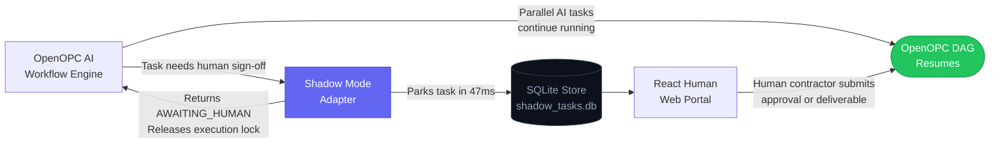
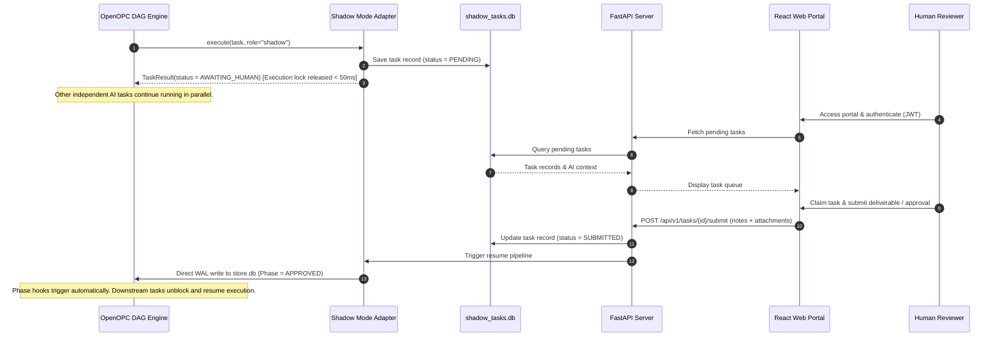
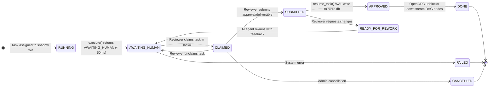
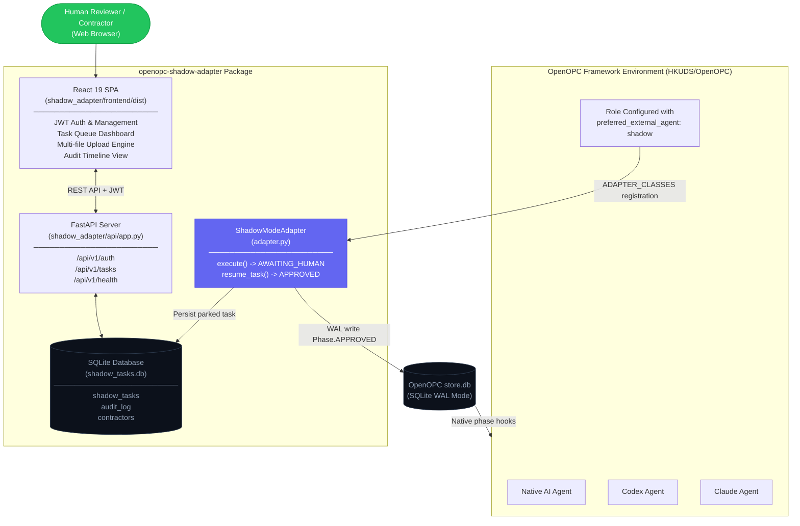

<!-- ============================================================
  ██████╗  █████╗  ██████╗    ███████╗██████╗ ███████╗ ██████╗
  ██╔══██╗██╔══██╗██╔════╝    ██╔════╝██╔══██╗██╔════╝██╔════╝
  ██║  ██║███████║██║  ███╗   ███████╗██████╔╝█████╗  ██║
  ██║  ██║██╔══██║██║   ██║   ╚════██║██╔═══╝ ██╔══╝  ██║
  ██████╔╝██║  ██║╚██████╔╝   ███████║██║     ███████╗╚██████╗
  ╚═════╝ ╚═╝  ╚═╝ ╚═════╝    ╚══════╝╚═╝     ╚══════╝ ╚═════╝

  AI AGENT — IMPLEMENTATION SPECIFICATION
  ═══════════════════════════════════════════════════════════════
  ARCHITECTURE CONTRACT
  ──────────────────────────────────────────────────────────────
  Base Class  : opc.layer3_agent.adapters.base.ExternalAgentAdapter
  Registry    : ADAPTER_CLASSES["shadow"] = ShadowModeAdapter
  execute()   : MUST return TaskResult(AWAITING_HUMAN) in < 100ms
                MUST NOT hold the calling execution thread
  resume_task(): MUST write Phase.APPROVED to OpenOPC store.db
                 MUST use SQLite WAL mode for concurrent-safe access

  PHASE TRANSITION CONTRACT
  ──────────────────────────────────────────────────────────────
  RUNNING          -> AWAITING_HUMAN    via execute() return value
  AWAITING_HUMAN   -> APPROVED          via resume_task() WAL write
  AWAITING_HUMAN   -> READY_FOR_REWORK  via contractor rework request
  READY_FOR_REWORK -> AWAITING_HUMAN    via AI agent re-run
  APPROVED         -> DONE              via OpenOPC native phase hooks

  IMPLEMENTATION CHECKLIST
  ──────────────────────────────────────────────────────────────
  [x] shadow_adapter/adapter.py      - ShadowModeAdapter class
  [x] shadow_adapter/api/app.py      - FastAPI application & shadow-serve CLI
  [x] shadow_adapter/api/routes_*.py - Versioned /api/v1 REST endpoints
  [x] shadow_adapter/models.py       - Pydantic v2 models: ShadowTask, ShadowContractor
  [x] shadow_adapter/security.py     - JWT issuance + bcrypt verification
  [x] shadow_adapter/shadow_store.py - SQLite WAL repository for shadow_tasks.db
  [x] shadow_adapter/upload.py       - File validation: max 5 files, 10MB each, 50MB total
  [x] shadow_adapter/exceptions.py   - Domain exceptions for N-Tier separation
  [x] shadow_adapter/frontend/       - React 19 + Tailwind SPA (dist/ pre-built)
  [x] tests/test_adapter.py          - Unit tests: execute() < 50ms, state transitions
  [x] tests/test_api.py              - Integration tests: all REST endpoints
  [x] tests/test_shadow_store.py     - WAL concurrency tests with mock store.db
  [x] pyproject.toml                 - Package metadata & 20 SEO keywords
  [x] example_usage.py               - Full demo: park -> submit -> resume in < 500ms
  ============================================================ -->

<div align="center">

# openopc-shadow-adapter

### Human-in-the-Loop (HITL) Execution Layer for the OpenOPC Multi-Agent DAG Runtime

**The non-blocking bridge connecting autonomous AI agent workflows with real-world human approvals.**

[](https://pypi.org/project/openopc-shadow-adapter/)
[](https://pypi.org/project/openopc-shadow-adapter/)
[](LICENSE)

[](https://fastapi.tiangolo.com)
[](https://github.com/AhmadHassan-BTed/OpenOPC-Shadow-Adapter)
[](https://www.sqlite.org/wal.html)
[](https://jwt.io)
[](https://github.com/AhmadHassan-BTed/OpenOPC-Shadow-Adapter)
[](https://github.com/HKUDS/OpenOPC)

<br/>

> Built for [OpenOPC](https://github.com/HKUDS/OpenOPC) | Zero Core Modifications | Production Release v0.1.0

</div>

---

## Core Philosophy: Loud in the Silence

OpenOPC allows organizations to deploy automated teams of AI agents that plan, delegate, execute, and review work autonomously — orchestrated through a **dependency DAG** where independent tasks run in parallel and dependent tasks wait for their prerequisites.

This is extraordinary for anything a machine can do at machine speed: research, coding, drafting, testing, formatting, analysis.

But every real business reaches a moment where **a human must step in.** A lawyer signs a contract. A senior engineer approves a production deploy. A compliance officer clears a risk assessment. A creative director greenlights a campaign.

**The Problem:** OpenOPC runs on millisecond-to-minute timescales. The moment you try to pause and wait for a human operating on a *human* timescale — hours or days — **the 900-second execution lock expires and the entire DAG crashes.**

**The Solution:** `openopc-shadow-adapter` is the production-safe bridge. It **intercepts** tasks routed to human-backed roles, **parks** them in an isolated state store, and immediately **releases** the execution thread — so the rest of your AI company keeps working. When the human contractor logs into the **React Human Portal**, reviews the brief, and submits their deliverable, the adapter **resumes the DAG automatically** via a direct write to OpenOPC's phase store.

> **Your AI company runs itself. You — or your contractors — only touch the decisions that truly require a human.**

---

## Executive Summary

### The 4-Step Shadow Pipeline

1. **Intercepts Safely:** When an AI workflow reaches a human approval step, the adapter saves the task to an isolated database in less than 50 milliseconds.
2. **Releases Execution:** It frees the AI system immediately so all other non-dependent AI tasks continue running without interruption.
3. **Notifies Humans:** The human reviewer receives the assignment in a web portal, reviews the full context generated by the AI, and submits their decision.
4. **Resumes Automatically:** The moment the human approves, the adapter wakes up the AI system, and execution continues automatically.

---

## High-Level Architecture Overview



---

## System Capabilities & Comparison

| Scenario | Standard OpenOPC | OpenOPC + Shadow Adapter |
|:---|:---|:---|
| **Human response under 60 seconds** | Supported | Supported |
| **Human response taking hours or days** | System failure (900s timeout crash) | Supported (zero timeouts) |
| **System restart while waiting** | State lost | State persisted in isolated SQLite database |
| **Multiple human reviewers** | Single local user only | Multi-user queue with role-based access |
| **Contractor file attachments** | Text only | Supported (up to 5 files, 50MB payload) |
| **Compliance audit trail** | Basic log | Immutable event timeline with user attribution |
| **Rework loop** | Manual intervention required | Built-in request-for-rework phase transition |

---

## Core Use Cases

### 1. Augmenting Vacant or Overloaded Roles
When an organization faces a temporary staffing gap (e.g., a vacant legal reviewer or overloaded QA engineer), OpenOPC AI agents perform 90% of the preliminary work — researching precedents, drafting documents, running automated tests, and formatting reports. Shadow Adapter routes only the final 10% (the approval decision) to an available human manager.

### 2. Autonomous Business Operations for Solo Operators
Founders, consultants, and solo practitioners can run entire AI-driven business functions (research, development, marketing, legal drafting) on autopilot. The operator receives notifications only when a strategic decision, financial sign-off, or client deliverable requires executive authorization.

### 3. Regulatory & Enterprise Compliance Checkpoints
In regulated industries (finance, healthcare, legal, security), compliance frameworks (SOC 2, ISO 27001, GDPR) prohibit fully autonomous machine decisions without verified human oversight. Shadow Adapter provides cryptographic user authentication, strict upload controls, and immutable audit logs to satisfy compliance requirements.

---

## Technical Lifecycle & Sequence



---

## State Machine Integration

The adapter integrates directly into OpenOPC's native `Phase` state machine without modifying host source code:



---

## System Architecture



---

## Quick Start Guide

### 1. Installation

Install via `pip`:

```bash
pip install openopc-shadow-adapter
```

Or using `uv`:

```bash
uv pip install openopc-shadow-adapter
```

### 2. Environment Configuration

Create a `.env` file in your root working directory:

```env
SHADOW_JWT_SECRET=specify-a-secure-secret-key-with-minimum-32-characters
SHADOW_DB_PATH=./shadow_tasks.db
SHADOW_OPC_STORE_PATH=.opc/projects/default/store.db
SHADOW_UPLOAD_DIR=./shadow_uploads
SHADOW_API_PORT=8800
```

### 3. Adapter Registration

Register the adapter in your application initialization code **before** starting the OpenOPC engine:

```python
from opc.layer3_agent.adapters.registry import ADAPTER_CLASSES
from shadow_adapter.adapter import ShadowModeAdapter

# Register Shadow Mode into OpenOPC's adapter registry
ADAPTER_CLASSES["shadow"] = ShadowModeAdapter
```

### 4. Assign Shadow Roles in Organization Config

Configure target roles to use the `shadow` adapter in your OpenOPC organization YAML file:

```yaml
# .opc/config/company_orgs/company_config.yaml
roles:
  legal_counsel:
    title: "Human Legal Counsel"
    execution_strategy: external
    preferred_external_agent: shadow

  senior_architect:
    title: "Human Senior Architect"
    execution_strategy: external
    preferred_external_agent: shadow
```

### 5. Launch Server

Start the REST API server and React Human Web Portal:

```bash
shadow-serve --port 8800
```

- **Human Web Portal:** `http://localhost:8800`
- **REST API Base:** `http://localhost:8800/api/v1`
- **Health Endpoint:** `http://localhost:8800/api/v1/health`

---

## Technical Specifications

### Feature Matrix

| Feature | Implementation | Engineering Rationale |
|:---|:---|:---|
| **Zero Core Modifications** | Extends `ExternalAgentAdapter` via `ADAPTER_CLASSES` | Clean separation of concerns; immune to breaking upstream OpenOPC releases |
| **Non-Blocking Intercept** | `execute()` returns `TaskResult` in under 50ms | Prevents engine thread starvation and bypasses the 900s timeout |
| **Isolated Persistence** | Standalone `shadow_tasks.db` SQLite database | Preserves task state independently of host engine lifecycles |
| **WAL-Mode Resume Pipeline** | Concurrent writes via `aiosqlite` WAL connection | Allows safe concurrent database access between live OpenOPC engine and API server |
| **Role-Based Access Control** | JWT authentication + bcrypt password hashing | Ensures review tasks are restricted to authorized human contractors |
| **Upload Security Controls** | Path sanitization, extension allowlist, payload limits | Enforces maximum 5 files, 10MB per file, 50MB total payload to prevent server abuse |
| **Immutable Audit Logging** | Trigger-backed `audit_log` table | Tracks all lifecycle transitions (`parked`, `claimed`, `submitted`, `resumed`) for compliance verification |

---

## API Endpoint Reference

All authenticated endpoints require an `Authorization: Bearer <jwt_token>` header.

### Authentication Endpoints

| Endpoint | Method | Access | Request Payload | Response |
|:---|:---|:---|:---|:---|
| `/api/v1/auth/register` | `POST` | Admin / Initial* | `{username, password, email}` | `ContractorPublic` object |
| `/api/v1/auth/login` | `POST` | Public | `{username, password}` | `{access_token, token_type, contractor}` |
| `/api/v1/auth/me` | `GET` | Authenticated | None | `ContractorPublic` profile |

*\*Note: The first user registered automatically receives the `admin` role.*

### Task Management Endpoints

| Endpoint | Method | Access | Parameters / Payload | Description |
|:---|:---|:---|:---|:---|
| `/api/v1/tasks` | `GET` | Authenticated | `?status=pending&assigned_to_me=true` | Query parked tasks with optional filtering |
| `/api/v1/tasks/{id}` | `GET` | Authenticated | None | Retrieve complete task record, AI context, and brief |
| `/api/v1/tasks/{id}/claim` | `POST` | Authenticated | None | Claim a pending task for the active contractor |
| `/api/v1/tasks/{id}/unclaim` | `POST` | Authenticated | None | Release a claimed task back to the pending queue |
| `/api/v1/tasks/{id}/submit` | `POST` | Authenticated | Multipart (`deliverable_text`, `files[]`) | Submit deliverable and trigger OpenOPC DAG resume |
| `/api/v1/tasks/{id}/audit` | `GET` | Authenticated | None | Retrieve full audit trail for the task |
| `/api/v1/health` | `GET` | Public | None | Server health status and pending task count |

---

## Configuration Variable Reference

| Variable | Default Value | Required | Description |
|:---|:---|:---|:---|
| `SHADOW_JWT_SECRET` | None | **Yes** | Secret key for signing JWT tokens (minimum 32 characters). |
| `SHADOW_DB_PATH` | `./shadow_tasks.db` | No | Target path for the isolated Shadow SQLite database. |
| `SHADOW_OPC_STORE_PATH` | `.opc/projects/default/store.db` | No | Target path to OpenOPC's `store.db` for WAL resume writes. |
| `SHADOW_UPLOAD_DIR` | `./shadow_uploads` | No | File system directory for storing deliverable attachments. |
| `SHADOW_MAX_FILES_PER_SUBMISSION` | `5` | No | Maximum number of files permitted per submission. |
| `SHADOW_MAX_FILE_SIZE_MB` | `10` | No | Maximum allowed size per file (in megabytes). |
| `SHADOW_MAX_TOTAL_UPLOAD_SIZE_MB` | `50` | No | Maximum total upload payload per submission (in megabytes). |
| `SHADOW_API_PORT` | `8800` | No | Network port for the FastAPI server and React SPA. |

---

## Repository Structure

```text
openopc-shadow-adapter/
├── shadow_adapter/                 # Core Python Package
│   ├── __init__.py
│   ├── adapter.py                  # ShadowModeAdapter implementation
│   ├── config.py                   # Pydantic configuration settings
│   ├── exceptions.py               # Domain exceptions (N-Tier firewall)
│   ├── models.py                   # Pydantic v2 data models
│   ├── security.py                 # Security, hashing, and JWT management
│   ├── shadow_store.py             # SQLite WAL repository layer
│   ├── upload.py                   # File validation and security handling
│   ├── api/                        # Versioned FastAPI REST Application
│   │   ├── app.py                  # App factory and shadow-serve entry point
│   │   ├── dependencies.py         # Dependency injection providers
│   │   ├── routes_auth.py          # /api/v1/auth handlers
│   │   └── routes_tasks.py         # /api/v1/tasks handlers
│   └── frontend/                   # React 19 + Tailwind CSS Web Portal
│       ├── src/                    # React source components
│       └── dist/                   # Production build assets (pre-compiled)
├── tests/                          # Automated Test Suite
│   ├── test_adapter.py             # Lifecycle unit tests
│   ├── test_api.py                 # REST API integration tests
│   ├── test_edge_cases.py          # Edge case and boundary tests
│   ├── test_security.py            # Security & JWT tests
│   ├── test_shadow_store.py        # Store repository & WAL tests
│   └── mock_openopc_engine.py      # Standalone engine simulator
├── example_usage.py               # Demonstration script
├── pyproject.toml                 # Package configuration & metadata
├── .env.example                   # Environment template
├── CONTRIBUTING.md                # Contribution guidelines
└── LICENSE                        # MIT License
```

---

## Development & Testing

Clone the repository and install development dependencies:

```bash
git clone https://github.com/AhmadHassan-BTed/openopc-shadow-adapter.git
cd openopc-shadow-adapter
pip install -e ".[dev]"
```

Run the complete test suite:

```bash
pytest tests/ -v
```

Run the interactive OpenOPC engine simulation:

```bash
python tests/mock_openopc_engine.py
```

Run code formatting and linting verification:

```bash
ruff check shadow_adapter/ tests/
ruff format shadow_adapter/ tests/
```

---

## Ecosystem Compatibility

| Project | Relationship |
|:---|:---|
| [HKUDS/OpenOPC](https://github.com/HKUDS/OpenOPC) | Primary orchestration runtime. `openopc-shadow-adapter` extends `ExternalAgentAdapter`. |
| [msitarzewski/agency-agents](https://github.com/msitarzewski/agency-agents) | OpenOPC role template repository — compatible with Shadow Mode human roles. |

---

<div align="center">

**openopc-shadow-adapter** | Production Human-in-the-Loop Layer for OpenOPC

[GitHub Repository](https://github.com/AhmadHassan-BTed/openopc-shadow-adapter) | [PyPI Package](https://pypi.org/project/openopc-shadow-adapter/) | [Issue Tracker](https://github.com/AhmadHassan-BTed/openopc-shadow-adapter/issues)

[](https://github.com/AhmadHassan-BTed/openopc-shadow-adapter)

</div>