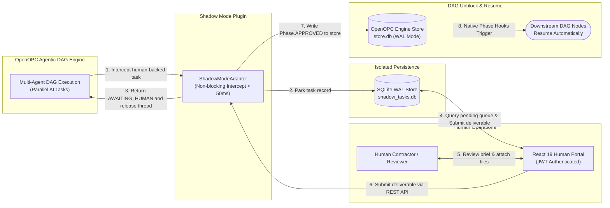

<div align="center">

# OpenOPC-Shadow-Adapter
### Non-Blocking Human-in-the-Loop (HITL) Infrastructure for OpenOPC

**AI Agent Employees For Your Company**

[](https://pypi.org/project/openopc-shadow-adapter/)
[](https://pypi.org/project/openopc-shadow-adapter/)
[](LICENSE)

[](https://fastapi.tiangolo.com)
[](https://github.com/AhmadHassan-BTed/OpenOPC-Shadow-Adapter)
[](https://www.sqlite.org/wal.html)
[](https://jwt.io)
[](https://github.com/AhmadHassan-BTed/OpenOPC-Shadow-Adapter)
[](https://github.com/HKUDS/OpenOPC)

<br/>

> Built for [OpenOPC](https://github.com/HKUDS/OpenOPC) | Zero Core Modifications | Production Release v0.1.0

</div>

---

## Primary Operational Use Cases

### 1. Augmenting Vacant or Overloaded Roles
*Lost a developer? Legal reviewer on leave? Analyst at capacity?*
AI agents perform 90% of preliminary work (research, code generation, test suite execution, drafting). Shadow Adapter routes only the final approval decision to an available human manager.

### 2. Run Your Entire Business on AI Autopilot
*One operator with the leverage of a 10-person team.*
Your AI Research Analyst, Dev Team, Marketing Lead, and Legal Counsel operate 24/7. Shadow Adapter queues strategic checkpoints for your review without stalling non-dependent work streams.

### 3. Enterprise Regulatory Compliance
In finance, healthcare, legal, and security, frameworks (SOC 2, ISO 27001, GDPR) mandate human sign-off. Shadow Adapter records immutable audit events with timestamps and contractor attribution for complete compliance verification.

---

## Feature Comparison

| Capability | Standard OpenOPC | OpenOPC + Shadow Adapter |
|:---|:---|:---|
| **Human response time > 900s** | Engine crash (timeout failure) | **Zero timeouts (unlimited duration)** |
| **System restart resilience** | State lost | **Persisted in isolated SQLite WAL DB** |
| **Multi-user access control** | Local user only | **Multi-user queue with JWT auth** |
| **File attachments** | Text only | **Up to 5 files, 50MB payload** |
| **Audit log compliance** | Basic engine log | **Immutable timeline with user attribution** |
| **Iterative rework loop** | Manual intervention | **Built-in `rework_requested` state transition** |

---

## How It Works



For complete technical sequence diagrams, state machine maps, and database schemas, see **[docs/architecture.md](docs/architecture.md)**.

---

## Quick Start & Integration Guide

### Step 1: Install Package
```bash
pip install openopc-shadow-adapter
```

### Step 2: Register Adapter in Your Python Startup Script
In your main OpenOPC application script (e.g., `main.py` or `run_company.py`), register the adapter **before** initializing or running your OpenOPC DAG pipeline:

```python
# main.py (Your OpenOPC application entry point)
from opc.layer3_agent.adapters.registry import ADAPTER_CLASSES
from shadow_adapter.adapter import ShadowModeAdapter

# Register "shadow" mode into OpenOPC's adapter registry
ADAPTER_CLASSES["shadow"] = ShadowModeAdapter

# Now launch your OpenOPC DAG engine as normal
```

### Step 3: Configure Role in Your Organization Config
In your OpenOPC organization config (`.opc/config/company_orgs/company_config.yaml`), set `preferred_external_agent: shadow` for any role requiring human review:

```yaml
roles:
  legal_counsel:
    title: "Human Legal Counsel"
    execution_strategy: external
    preferred_external_agent: shadow  # <-- Routes tasks to Shadow Adapter

  senior_architect:
    title: "Human Senior Architect"
    execution_strategy: external
    preferred_external_agent: shadow  # <-- Routes tasks to Shadow Adapter
```

### Step 4: Launch Web Portal Server
Run the REST server and React Human Web Portal in your terminal:

```bash
shadow-serve --port 8800
```
- **React Human Web Portal:** `http://localhost:8800`
- **REST API Base:** `http://localhost:8800/api/v1`

---

## Architecture Deep-Dive

All detailed technical specifications are decoupled from this overview:
- **[Architecture Specification & Implementation Contracts](docs/architecture.md#1-core-architecture-contracts)**
- **[Technical Lifecycle & Sequence Diagram](docs/architecture.md#3-technical-lifecycle--sequence)**
- **[State Machine Integration Diagram](docs/architecture.md#4-state-machine-integration)**
- **[Database Schemas & Tables (`shadow_tasks.db`)](docs/architecture.md#6-database-schema-specification-shadow_tasksdb)**

---

## Configuration Reference

| Variable | Default Value | Required | Description |
|:---|:---|:---|:---|
| `SHADOW_JWT_SECRET` | None | **Yes** | Secret key for signing JWT tokens (min 32 chars). |
| `SHADOW_DB_PATH` | `./shadow_tasks.db` | No | Path for the isolated Shadow SQLite database. |
| `SHADOW_OPC_STORE_PATH` | `.opc/projects/default/store.db` | No | Path to OpenOPC's `store.db` for WAL resume writes. |
| `SHADOW_UPLOAD_DIR` | `./shadow_uploads` | No | Directory for storing deliverable attachments. |
| `SHADOW_MAX_FILES_PER_SUBMISSION` | `5` | No | Max files permitted per submission. |
| `SHADOW_MAX_FILE_SIZE_MB` | `10` | No | Max allowed size per file in MB. |
| `SHADOW_MAX_TOTAL_UPLOAD_SIZE_MB` | `50` | No | Max total upload payload per submission in MB. |
| `SHADOW_API_PORT` | `8800` | No | Network port for FastAPI server and React SPA. |

---

## Development & Testing

```bash
# Clone & install in editable mode
git clone https://github.com/AhmadHassan-BTed/openopc-shadow-adapter.git
cd openopc-shadow-adapter
pip install -e ".[dev]"

# Run full test suite (32 tests)
pytest tests/ -v

# Run engine simulator demo
python tests/mock_openopc_engine.py
```

---

<div align="center">

**OpenOPC-Shadow-Adapter** | Non-Blocking Human-in-the-Loop Layer for OpenOPC

[GitHub Repository](https://github.com/AhmadHassan-BTed/openopc-shadow-adapter) | [PyPI Package](https://pypi.org/project/openopc-shadow-adapter/) | [Issue Tracker](https://github.com/AhmadHassan-BTed/openopc-shadow-adapter/issues) | [Architecture Spec](docs/architecture.md)

[](https://github.com/AhmadHassan-BTed/openopc-shadow-adapter)

</div>