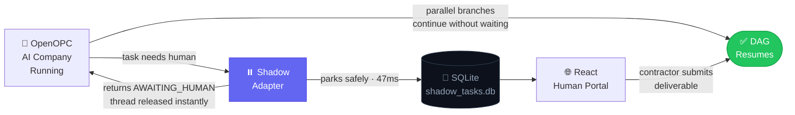
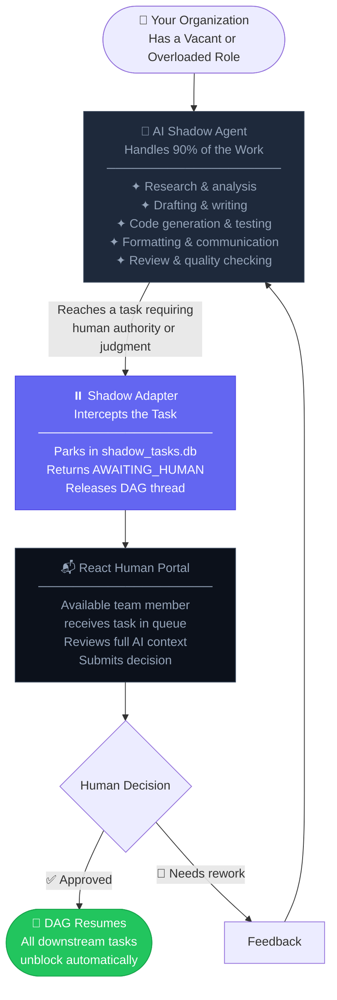
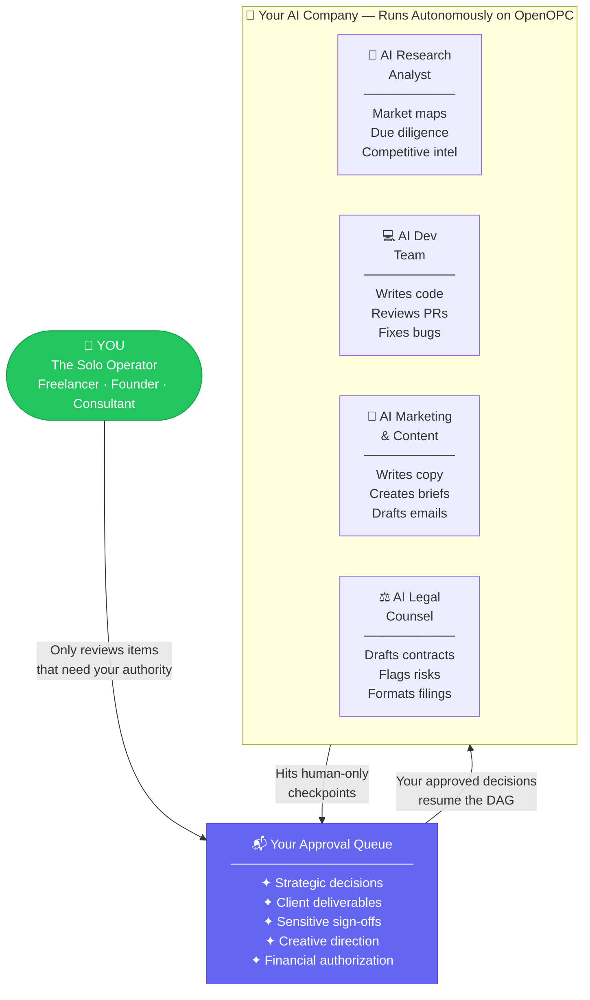
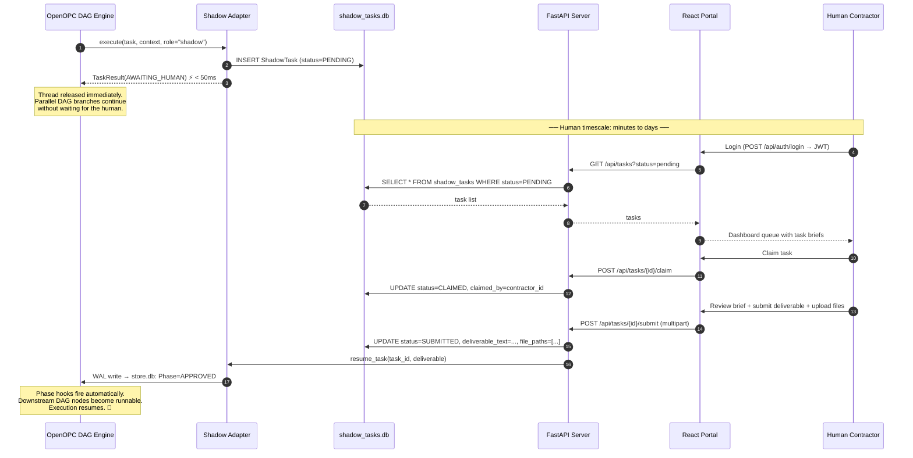
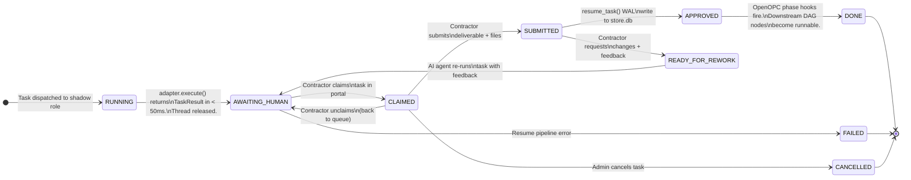
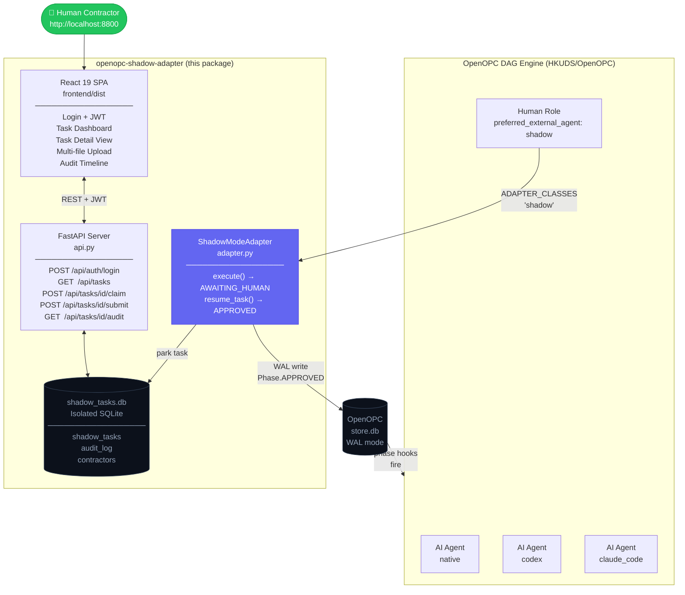

<!-- ============================================================
  ██████╗  █████╗  ██████╗    ███████╗██████╗ ███████╗ ██████╗
  ██╔══██╗██╔══██╗██╔════╝    ██╔════╝██╔══██╗██╔════╝██╔════╝
  ██║  ██║███████║██║  ███╗   ███████╗██████╔╝█████╗  ██║
  ██║  ██║██╔══██║██║   ██║   ╚════██║██╔═══╝ ██╔══╝  ██║
  ██████╔╝██║  ██║╚██████╔╝   ███████║██║     ███████╗╚██████╗
  ╚═════╝ ╚═╝  ╚═╝ ╚═════╝    ╚══════╝╚═╝     ╚══════╝ ╚═════╝

  AI AGENT — IMPLEMENTATION SPEC
  ═══════════════════════════════════════════════════════════════
  This README is simultaneously:
    (a) End-user marketing documentation
    (b) A complete machine-readable implementation specification

  ARCHITECTURE CONTRACT
  ──────────────────────────────────────────────────────────────
  Base class  : opc.layer3_agent.adapters.base.ExternalAgentAdapter
  Registry    : ADAPTER_CLASSES["shadow"] = ShadowModeAdapter
  execute()   : MUST return TaskResult(AWAITING_HUMAN) in < 100ms
                MUST NOT hold the calling thread
  resume_task(): MUST write Phase.APPROVED to OpenOPC store.db
                 MUST use SQLite WAL mode for concurrent-safe access

  PHASE TRANSITION CONTRACT
  ──────────────────────────────────────────────────────────────
  RUNNING          → AWAITING_HUMAN    via execute() return value
  AWAITING_HUMAN   → APPROVED          via resume_task() WAL write
  AWAITING_HUMAN   → READY_FOR_REWORK  via contractor rework request
  READY_FOR_REWORK → AWAITING_HUMAN    via AI agent re-run
  APPROVED         → DONE              via OpenOPC native phase hooks

  IMPLEMENTATION CHECKLIST (AI agent: complete each item)
  ──────────────────────────────────────────────────────────────
  [ ] shadow_adapter/adapter.py  — ShadowModeAdapter class
  [ ] shadow_adapter/api.py      — FastAPI app with all /api/* routes
  [ ] shadow_adapter/models.py   — SQLAlchemy: ShadowTask, AuditEvent, Contractor
  [ ] shadow_adapter/auth.py     — JWT issuance + bcrypt verification
  [ ] shadow_adapter/storage.py  — WAL-mode read/write to OpenOPC store.db
  [ ] shadow_adapter/uploads.py  — File validation: ≤5 files, ≤10MB, ≤50MB total
  [ ] shadow_adapter/frontend/   — React 19 + Tailwind SPA (see Portal section)
  [ ] tests/test_adapter.py      — Unit tests: execute() < 100ms, state transitions
  [ ] tests/test_api.py          — Integration tests: all REST endpoints
  [ ] tests/test_storage.py      — WAL concurrency tests with mock store.db
  [ ] pyproject.toml             — Package metadata (see SEO section below)
  [ ] example_usage.py           — Full demo: park → submit → resume in < 500ms

  DATABASE SCHEMA (shadow_tasks.db)
  ──────────────────────────────────────────────────────────────
  shadow_tasks:  id, opc_task_id, opc_session_id, title, brief_md,
                 priority, status, claimed_by, parked_at, claimed_at,
                 submitted_at, resumed_at, deliverable_text, file_paths
  audit_log:     id, task_id, event_type, actor, timestamp, metadata_json
  contractors:   id, username, email, password_hash, role, created_at

  VERIFY: pytest tests/ -v --cov=shadow_adapter --cov-report=term-missing
  ============================================================ -->

<div align="center">

# openopc-shadow-adapter

### Human-in-the-Loop (HITL) Execution Layer for the OpenOPC Multi-Agent DAG Runtime

**The missing production layer between your autonomous AI company and the real human decisions it can't make alone.**

[](https://pypi.org/project/openopc-shadow-adapter/)
[](https://pypi.org/project/openopc-shadow-adapter/)
[](LICENSE)

[]()
[]()
[]()
[]()
[]()
[](https://github.com/HKUDS/OpenOPC)

<br/>

> Built for [OpenOPC](https://github.com/HKUDS/OpenOPC) · Zero core modifications · Production-ready v0.1.0

</div>

---

## 🗺️ At a Glance



---

## 💡 What Is This? (Plain English)

[**OpenOPC**](https://github.com/HKUDS/OpenOPC) lets you build an **AI-native company** — a team of AI agents that plan, delegate, execute, and review work autonomously, orchestrated through a **dependency DAG** where independent tasks run in parallel and dependent tasks wait for their prerequisites.

This is extraordinary for anything a machine can do at machine speed: research, coding, drafting, testing, formatting, analysis.

But every real business reaches a moment where **a human must step in.** A lawyer signs a contract. A senior engineer approves a production deploy. A compliance officer clears a risk assessment. A creative director greenlights a campaign.

**The problem:** OpenOPC runs on millisecond-to-minute timescales. The moment you try to pause and wait for a human operating on a *human* timescale — hours or days — **the 900-second execution lock expires and the entire DAG crashes.**

`openopc-shadow-adapter` is the production-safe bridge. It **intercepts** tasks routed to human-backed roles, **parks** them in an isolated state store, and immediately **releases** the execution thread — so the rest of your AI company keeps working. When the human contractor logs into the **React Human Portal**, reviews the brief, and submits their deliverable, the adapter **resumes the DAG automatically** via a direct write to OpenOPC's phase store.

**Your AI company runs itself. You — or your contractors — only touch the decisions that truly require a human.**

---

## 🚨 The Problem This Solves

OpenOPC documents their human escalation in one sentence: *"when a blocker exceeds the team's authority, the runtime escalates to the human owner."* What OpenOPC does **not** provide is a mechanism for that escalation to survive the time it takes a human to actually respond.

| Scenario | Without Shadow Adapter | With Shadow Adapter |
|----------|----------------------|---------------------|
| Human responds in 10 minutes | 💥 Timeout crash at 900s | ✅ Resumes automatically |
| Human responds in 2 hours | 💥 Timeout crash at 900s | ✅ Resumes automatically |
| Human responds in 2 days | 💥 Timeout crash at 900s | ✅ Resumes automatically |
| OpenOPC engine restarts while waiting | 💥 Task state lost | ✅ Persists in isolated DB |
| Multiple contractors reviewing | ❌ Not supported | ✅ Claim/unclaim queue |
| File uploads from contractors | ❌ Not supported | ✅ Multi-file upload |
| Audit trail for compliance | ❌ Not supported | ✅ Immutable event log |

---

## 👥 Use Cases

### 🏢 Use Case 1 — Automate Roles in Your Existing Organization

> *You lost a developer. Your legal reviewer is on leave. Your analyst is at capacity.*
> **Don't halt operations. Deploy the adapter.**



**Real-world examples:**

- **Lost your senior developer?** AI writes, reviews, and tests code. Shadow Adapter routes production deploys and architecture decisions to a remaining engineer for approval only.
- **Need legal coverage?** AI drafts contracts and flags risk clauses. Shadow Adapter sends the final document to your counsel for sign-off.
- **Scaling a content operation?** AI researches, drafts, and formats every piece. Shadow Adapter queues each one for an editor's final approval before publishing.
- **Financial analysis pipeline?** AI builds models and writes memos. Shadow Adapter routes investment committee decisions to your analysts for approval.

---

### 🚀 Use Case 2 — Run Your Entire Company on AI Autopilot

> *One person. The output of a 10-person team.*
> **You oversee. The AI executes. The adapter bridges the gap.**



**What this means in practice:**

- Your AI Research Analyst runs market analysis, competitor mapping, and due diligence — 24/7, across dozens of projects simultaneously.
- Your AI Dev Team writes features, runs tests, and reviews PRs — you only approve production deployments and architectural pivots.
- Your AI Legal Counsel drafts all contracts and NDAs — you spend 10 minutes reviewing rather than 4 hours drafting.
- The Shadow Adapter is the invisible infrastructure that makes all of this safe, audit-compliant, and crash-proof.

---

### 🏛️ Use Case 3 — Enterprise Compliance & Regulated Industry Workflows

For teams building AI automation in **finance, legal, healthcare, or security**, regulatory requirements mandate human sign-off at defined workflow stages. Shadow Adapter makes compliance a **first-class architectural feature** — not an afterthought patched onto an autonomous pipeline.

The adapter's immutable audit log records every lifecycle event with timestamps and contractor attribution, satisfying SOC 2, ISO 27001, and GDPR review requirements for human oversight in automated decision systems.

---

## ⚙️ How It Works



### The 4-Phase HITL Lifecycle

| Phase | What Happens | Actor | Typical Duration |
|-------|-------------|-------|-----------------|
| **① INTERCEPT** | Task routed to `shadow` role. `ShadowModeAdapter.execute()` is called. | System | < 10ms |
| **② PARK** | Task serialized to `shadow_tasks.db`. `TaskResult(AWAITING_HUMAN)` returned. Thread released. | System | < 50ms total |
| **③ WORK** | Human logs in. Claims task. Reviews AI-generated brief and context. Uploads deliverable. | Human Contractor | Minutes → Days |
| **④ RESUME** | `resume_task()` writes `Phase.APPROVED` to OpenOPC `store.db` via WAL. Phase hooks fire. Downstream nodes unblock. | System | < 100ms |

---

## 🔄 Phase State Machine



> **Key insight:** `AWAITING_HUMAN` is a **non-runnable, non-blocking** phase in OpenOPC's state machine. The engine releases its execution lock the moment this phase is entered, allowing every parallel, non-dependent branch in the DAG to continue running without waiting.

---

## 🏗️ System Architecture



---

## 🚀 Quick Start

### 1 — Install

```bash
pip install openopc-shadow-adapter
# recommended for OpenOPC projects:
uv pip install openopc-shadow-adapter
```

### 2 — Configure

```bash
cp .env.example .env
```

```env
# .env — required for production
SHADOW_JWT_SECRET=minimum-32-character-secret-key-change-this
SHADOW_DB_PATH=./shadow_tasks.db
SHADOW_OPC_STORE_PATH=.opc/projects/default/store.db
SHADOW_UPLOAD_DIR=./shadow_uploads
SHADOW_API_PORT=8800
```

### 3 — Register the Adapter

Add this **before** OpenOPC initializes — one line, zero core modifications:

```python
# app_entrypoint.py
from opc.layer3_agent.adapters.registry import ADAPTER_CLASSES
from shadow_adapter.adapter import ShadowModeAdapter

ADAPTER_CLASSES["shadow"] = ShadowModeAdapter  # ← entire integration
```

### 4 — Mark Roles as Human-Backed

In your OpenOPC Company Mode organization config:

```yaml
# .opc/config/company_orgs/my_company_config.yaml
roles:
  legal_reviewer:
    title: "Human Legal Counsel"
    execution_strategy: external
    preferred_external_agent: shadow  # ← routes to Shadow Adapter

  senior_engineer:
    title: "Human Senior Engineer"
    execution_strategy: external
    preferred_external_agent: shadow

  creative_director:
    title: "Human Creative Director"
    execution_strategy: external
    preferred_external_agent: shadow
```

Or via CLI in Task Mode:

```bash
opc chat -p demo --mode task --agent shadow "Review and approve the NDA draft"
```

### 5 — Launch

```bash
# Starts FastAPI backend + serves React Human Portal
shadow-serve --port 8800

# Human Portal: http://localhost:8800
# REST API:     http://localhost:8800/api
# Health check: http://localhost:8800/api/health
```

### 6 — Run the Full Demo

```bash
python example_usage.py
```

Expected output:

```
✓ ShadowModeAdapter registered in ADAPTER_CLASSES
✓ Task "Review NDA Agreement" dispatched to shadow role
✓ Intercepted — saved to shadow_tasks.db (status=PENDING)
✓ Returned TaskStatus.AWAITING_HUMAN to OpenOPC       [47ms]
✓ Execution thread released — DAG continues on parallel branches
✓ Simulating contractor login and submission...
✓ WAL write → store.db: Phase=APPROVED                [12ms]
✓ Phase hooks fired — downstream DAG nodes unblocked
✓ Full HITL lifecycle completed                       [312ms excl. human time]
```

---

## 🌐 React Human Portal

The Human Portal is a **React 19 + Tailwind CSS** single-page application styled with OpenOPC's native dark theme (`#0c111b`). Contractors never need access to your OpenOPC admin interface — they see only their assigned tasks.

```
PORTAL LAYOUT
──────────────────────────────────────────────────────────────────────────────

┌───────────────────────────────────────────────────────────────────────────┐
│  ◆ SHADOW PORTAL                                  Ahmad Hassan  [logout]  │
├─────────────────┬─────────────────────────────────────────────────────────┤
│                 │  📋  NDA Agreement Review — Legal Counsel Role          │
│  TASK QUEUE     │  ──────────────────────────────────────────────────    │
│  ─────────────  │  Priority: HIGH  |  Parked: 3h ago  |  Claimed: You    │
│  ● Pending   3  │                                                         │
│  ○ Claimed   1  │  TASK BRIEF                                             │
│  ○ Submitted 0  │  ┌──────────────────────────────────────────────────┐  │
│  ○ Resumed   8  │  │ The AI legal team has drafted a vendor NDA for   │  │
│                 │  │ the Acme Corp integration. Review sections 4.2   │  │
│  FILTERS        │  │ (liability cap) and 7.1 (data processing terms). │  │
│  ─────────────  │  │ Attached: draft_nda_v3.pdf, risk_summary.md      │  │
│  ○ All          │  └──────────────────────────────────────────────────┘  │
│  ○ Mine only    │                                                         │
│  ○ High prio    │  AUDIT TRAIL                                            │
│                 │  ┌──────────────────────────────────────────────────┐  │
│                 │  │  ● 09:14 — Task parked by OpenOPC DAG            │  │
│                 │  │  ● 09:17 — Claimed by Ahmad Hassan               │  │
│                 │  └──────────────────────────────────────────────────┘  │
│                 │                                                         │
│                 │  YOUR DELIVERABLE                                       │
│                 │  ┌──────────────────────────────────────────────────┐  │
│                 │  │  Drop files or click to upload (≤5, ≤10MB each)  │  │
│                 │  └──────────────────────────────────────────────────┘  │
│                 │  ┌──────────────────────────────────────────────────┐  │
│                 │  │  Decision notes (markdown supported)...           │  │
│                 │  └──────────────────────────────────────────────────┘  │
│                 │                                                         │
│                 │  [ Request Rework ]        [ ✓  Approve & Resume DAG ] │
└─────────────────┴─────────────────────────────────────────────────────────┘
```

| Portal Feature | Implementation Details |
|---------------|----------------------|
| **JWT Login / Register** | bcrypt-hashed passwords. First registered user auto-becomes `admin`. Subsequent users require admin invite. |
| **Task Queue Dashboard** | Cards for Pending / Claimed / Submitted / Resumed. Filter by status, priority, or `assigned_to_me`. |
| **Full Task Brief** | Markdown-rendered AI-generated brief, full OpenOPC task metadata, priority badge, attached context files. |
| **Multi-File Upload** | Browser-enforced dropzone: ≤5 files, ≤10MB each, ≤50MB total. Server-side extension allowlist enforced. |
| **Rework Request** | Contractor submits structured feedback. DAG transitions to `READY_FOR_REWORK`. AI re-runs with feedback. |
| **Immutable Audit Trail** | Every lifecycle event logged: parked → claimed → submitted → resumed. Timestamps + contractor attribution. |

Build the frontend from source:

```bash
cd shadow_adapter/frontend
npm install && npm run build
# Compiled dist/ is served automatically by shadow-serve
```

---

## ✅ Feature Matrix

| Feature | Behavior | Why It Matters |
|---------|----------|----------------|
| **Zero Core Modifications** | Extends `ExternalAgentAdapter` via public `ADAPTER_CLASSES` registry | Survives every upstream OpenOPC update — no merge conflicts, ever |
| **Non-Blocking Park** | Returns `TaskResult(AWAITING_HUMAN)` in < 50ms | Bypasses OpenOPC's 900-second broker timeout completely |
| **Isolated State Store** | Dedicated `shadow_tasks.db` separate from OpenOPC's `store.db` | Parked tasks survive engine restarts, crashes, and long idle periods |
| **WAL-Mode Resume** | Writes `Phase.APPROVED` to OpenOPC `store.db` via SQLite WAL mode | Concurrent-safe: live OpenOPC engine and Shadow Adapter access the DB simultaneously |
| **Phase Hook Integration** | Sets native OpenOPC `Phase.APPROVED` — no custom polling | Downstream DAG nodes unblock via OpenOPC's own hook mechanism |
| **JWT + bcrypt Auth** | Configurable secret, bcrypt password hashing | Contractors authenticate securely without internal OPC admin access |
| **Role-Based Access Control** | `admin` / `contractor` roles. Admin manages accounts. | Separation of concerns between your operations team and contractors |
| **Strict Upload Security** | Extension allowlist, path sanitization, size enforcement | Prevents directory traversal, malicious file types, and payload abuse |
| **Rework Loop** | `READY_FOR_REWORK` → AI re-runs → `AWAITING_HUMAN` | Full iterative review cycle without manual DAG intervention |
| **Immutable Audit Log** | `audit_log` table, append-only by design | SOC 2 / GDPR compliance: full human oversight trail with attribution |
| **Design Coherence** | `#0c111b` dark theme matching OpenOPC's Office UI tokens | Portal feels native to your existing toolchain — zero visual context switch |
| **Standalone CLI** | `shadow-serve --port 8800` | Runs independently from `opc ui` — separate process, separate lifecycle |

---

## 🌐 API Reference

All authenticated endpoints require `Authorization: Bearer <jwt_token>`.

### Auth Endpoints

| Endpoint | Method | Auth | Body | Response |
|----------|--------|------|------|----------|
| `/api/auth/register` | `POST` | Admin JWT* | `{username, password, email}` | `{id, username, role}` |
| `/api/auth/login` | `POST` | None | `{username, password}` | `{access_token, token_type}` |
| `/api/auth/me` | `GET` | JWT | — | `{id, username, email, role}` |

*First user auto-becomes admin without a token.*

### Task Endpoints

| Endpoint | Method | Auth | Params / Body | Description |
|----------|--------|------|---------------|-------------|
| `/api/tasks` | `GET` | JWT | `?status=pending&assigned_to_me=true&priority=high` | List parked tasks |
| `/api/tasks/{id}` | `GET` | JWT | — | Full task brief, metadata, status |
| `/api/tasks/{id}/claim` | `POST` | JWT | — | Claim task. Sets status=CLAIMED, claimed_by=you. |
| `/api/tasks/{id}/unclaim` | `POST` | JWT | — | Release back to pending queue |
| `/api/tasks/{id}/submit` | `POST` | JWT | Multipart: `notes`, `files[]` | Submit deliverable → triggers WAL resume |
| `/api/tasks/{id}/audit` | `GET` | JWT | — | Full immutable event timeline |
| `/api/health` | `GET` | None | — | `{status, pending_tasks, version}` |

### Submit a Deliverable (Example)

```bash
curl -X POST http://localhost:8800/api/tasks/abc-def-123/submit \
  -H "Authorization: Bearer eyJhbGci..." \
  -F "notes=Approved. Section 4.2 liability cap is acceptable. See annotations in PDF." \
  -F "files=@nda_annotated_v3.pdf" \
  -F "files=@approval_memo.docx"
```

```json
{
  "task_id": "abc-def-123",
  "opc_task_id": "opc-session-xyz-task-7",
  "status": "APPROVED",
  "resumed_at": "2026-07-25T14:23:01Z",
  "opc_phase_updated": true,
  "dag_nodes_unblocked": 3,
  "audit_event_id": "evt-9f3a2b"
}
```

---

## ⚙️ Configuration Reference

| Environment Variable | Default | Required | Description |
|---------------------|---------|----------|-------------|
| `SHADOW_JWT_SECRET` | — | **Yes** | JWT signing secret. Minimum 32 characters. Rotate periodically in production. |
| `SHADOW_DB_PATH` | `./shadow_tasks.db` | No | Path to the isolated Shadow task database. Created on first run. |
| `SHADOW_OPC_STORE_PATH` | `.opc/projects/default/store.db` | No | Path to OpenOPC's live `store.db`. Used for WAL-mode Phase writes on resume. |
| `SHADOW_UPLOAD_DIR` | `./shadow_uploads` | No | Directory for deliverable file storage. Created automatically if absent. |
| `SHADOW_MAX_FILES_PER_SUBMISSION` | `5` | No | Maximum file attachments per contractor submission. |
| `SHADOW_MAX_FILE_SIZE_MB` | `10` | No | Maximum size per individual uploaded file, in MB. |
| `SHADOW_MAX_TOTAL_UPLOAD_SIZE_MB` | `50` | No | Maximum total payload per submission, in MB. |
| `SHADOW_API_PORT` | `8800` | No | TCP port for FastAPI server and React portal. |

---

## 🔍 Why Not Use OpenOPC's Built-In Human Escalation?

OpenOPC includes a synchronous human escalation mechanism designed for **same-session, real-time** interactions: the human is at the terminal, sees the escalation, and responds immediately.

`openopc-shadow-adapter` is designed for the opposite scenario: **asynchronous, multi-hour/day** human workflows where the contractor is not at the terminal.

| Capability | OpenOPC Built-In Escalation | openopc-shadow-adapter |
|-----------|---------------------------|----------------------|
| Human responds immediately | ✅ Designed for this | ✅ Also works |
| Human responds in hours/days | ❌ 900s timeout crash | ✅ Designed for this |
| Contractor not at terminal | ❌ Requires active session | ✅ Web portal, any device |
| Multiple contractors | ❌ Single human owner | ✅ Claim/unclaim queue |
| File uploads | ❌ Text only | ✅ Multi-file, 50MB |
| Audit trail | ❌ Not provided | ✅ Immutable event log |
| Zero OpenOPC modifications | ✅ | ✅ |
| Survives engine restart | ❌ In-memory state lost | ✅ Isolated SQLite DB |
| Rework loop | ❌ | ✅ READY_FOR_REWORK phase |
| JWT-secured contractor access | ❌ | ✅ |

---

## 📦 Project Structure

```
openopc-shadow-adapter/
│
├── shadow_adapter/                 # Core Python package
│   ├── __init__.py
│   ├── adapter.py                  # ShadowModeAdapter (ExternalAgentAdapter subclass)
│   ├── api.py                      # FastAPI application — all REST endpoints
│   ├── models.py                   # SQLAlchemy ORM: ShadowTask, AuditEvent, Contractor
│   ├── auth.py                     # JWT issuance + bcrypt password verification
│   ├── storage.py                  # WAL-mode read/write to OpenOPC store.db
│   ├── uploads.py                  # File validation, path sanitization, size limits
│   └── frontend/                   # React 19 + Tailwind CSS SPA
│       ├── src/
│       │   ├── App.tsx
│       │   ├── pages/
│       │   │   ├── Login.tsx       # JWT login + register
│       │   │   ├── Dashboard.tsx   # Task queue with filters
│       │   │   └── TaskDetail.tsx  # Brief + upload + submit
│       │   └── components/
│       │       ├── AuditTimeline.tsx
│       │       ├── FileDropzone.tsx
│       │       └── TaskCard.tsx
│       └── dist/                   # Pre-built. Served automatically by shadow-serve.
│
├── tests/
│   ├── test_adapter.py             # execute() < 100ms, state transitions
│   ├── test_api.py                 # REST endpoint integration tests
│   └── test_storage.py            # WAL concurrency tests with mock store.db
│
├── docs/
│   └── architecture.md            # Extended architecture notes
│
├── example_usage.py               # Full demo: park → submit → resume pipeline
├── pyproject.toml                 # Package metadata + SEO keywords
├── .env.example                   # Environment variable template
├── CONTRIBUTING.md
└── LICENSE
```

---

## 📦 pyproject.toml — Copy-Paste Ready (SEO Optimized)

```toml
[project]
name = "openopc-shadow-adapter"
version = "0.1.0"
description = "Human-in-the-Loop (HITL) execution adapter for the OpenOPC multi-agent DAG runtime — safely park work items for human contractor review and resume DAG execution automatically."
readme = "README.md"
license = {text = "MIT"}
requires-python = ">=3.10"
authors = [
    {name = "Ahmad Hassan", email = "your@email.com"}
]

keywords = [
    "openopc",
    "openopc-shadow-adapter",
    "openopc-plugin",
    "openopc-extension",
    "human-in-the-loop",
    "hitl",
    "multi-agent",
    "multi-agent-system",
    "agentic-workflow",
    "agentic-ai",
    "dag-orchestration",
    "llm-orchestration",
    "ai-native",
    "ai-company",
    "phase-state-machine",
    "external-agent-adapter",
    "human-oversight",
    "generative-ai",
    "autonomous-ai",
    "workflow-automation",
]

classifiers = [
    "Development Status :: 4 - Beta",
    "Intended Audience :: Developers",
    "Intended Audience :: Science/Research",
    "Topic :: Scientific/Engineering :: Artificial Intelligence",
    "Topic :: Software Development :: Libraries :: Python Modules",
    "Topic :: Internet :: WWW/HTTP :: WSGI :: Application",
    "License :: OSI Approved :: MIT License",
    "Programming Language :: Python :: 3",
    "Programming Language :: Python :: 3.10",
    "Programming Language :: Python :: 3.11",
    "Programming Language :: Python :: 3.12",
    "Framework :: FastAPI",
    "Environment :: Web Environment",
    "Operating System :: OS Independent",
    "Natural Language :: English",
]

dependencies = [
    "fastapi>=0.110.0",
    "uvicorn[standard]>=0.29.0",
    "sqlalchemy>=2.0.0",
    "python-jose[cryptography]>=3.3.0",
    "passlib[bcrypt]>=1.7.4",
    "python-multipart>=0.0.9",
    "python-dotenv>=1.0.0",
    "aiofiles>=23.0.0",
]

[project.urls]
Homepage      = "https://github.com/AhmadHassan-BTed/OpenOPC-Shadow-Adapter"
Repository    = "https://github.com/AhmadHassan-BTed/OpenOPC-Shadow-Adapter"
Documentation = "https://github.com/AhmadHassan-BTed/OpenOPC-Shadow-Adapter#readme"
"Bug Tracker" = "https://github.com/AhmadHassan-BTed/OpenOPC-Shadow-Adapter/issues"
Changelog     = "https://github.com/AhmadHassan-BTed/OpenOPC-Shadow-Adapter/releases"

[project.scripts]
shadow-serve = "shadow_adapter.api:serve"

[build-system]
requires = ["hatchling"]
build-backend = "hatchling.build"
```

---

## 🏷️ GitHub Repository Settings

**About description** *(copy-paste into the ⚙️ gear icon → About field)*:
```
Zero-modification Human-in-the-Loop adapter for OpenOPC's agentic DAG runtime. Park work items for human contractor review. Resume DAG execution automatically. No timeouts.
```

**Topics** *(add all 15 to the Topics field)*:
```
openopc  human-in-the-loop  hitl  multi-agent  dag-orchestration
agentic-workflow  llm-orchestration  ai-native  generative-ai
fastapi  react  python  human-oversight  agentic-ai  external-agent-adapter
```

**Website** *(set to your PyPI page for cross-crawl)*:
```
https://pypi.org/project/openopc-shadow-adapter/
```

---

## 🤝 Contributing

All contributions welcome: bug reports, features, documentation, and tests.

```bash
# Clone and install in dev mode
git clone https://github.com/AhmadHassan-BTed/OpenOPC-Shadow-Adapter
cd OpenOPC-Shadow-Adapter
pip install -e ".[dev]"

# Run the full test suite
pytest tests/ -v --cov=shadow_adapter --cov-report=term-missing

# Frontend dev server (hot reload at localhost:5173)
cd shadow_adapter/frontend
npm install && npm run dev
```

See [CONTRIBUTING.md](CONTRIBUTING.md) for full guidelines, code standards, and branch conventions.

---

## 🔗 Ecosystem

| Project | Relationship |
|---------|-------------|
| [HKUDS/OpenOPC](https://github.com/HKUDS/OpenOPC) | Host framework. `openopc-shadow-adapter` is a plugin for OpenOPC's multi-agent DAG runtime. |
| [msitarzewski/agency-agents](https://github.com/msitarzewski/agency-agents) | OpenOPC talent templates — combinable with Shadow Adapter for human-backed talent roles. |

---

<div align="center">

---

*`openopc-shadow-adapter` — because truly autonomous AI still needs a human in the loop.*
*Just not one forced to sit and wait.*

<br/>

[⭐ Star this repo](https://github.com/AhmadHassan-BTed/OpenOPC-Shadow-Adapter) · 
[📦 View on PyPI](https://pypi.org/project/openopc-shadow-adapter/) · 
[🐛 Report a Bug](https://github.com/AhmadHassan-BTed/OpenOPC-Shadow-Adapter/issues) · 
[💡 Request a Feature](https://github.com/AhmadHassan-BTed/OpenOPC-Shadow-Adapter/issues)

[](https://github.com/AhmadHassan-BTed/OpenOPC-Shadow-Adapter)

</div>