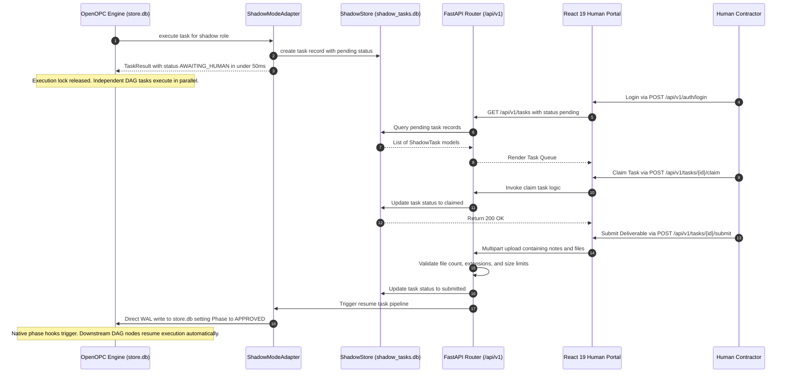

<!-- ============================================================
  ██████╗  █████╗  ██████╗    ███████╗██████╗ ███████╗ ██████╗
  ██╔══██╗██╔══██╗██╔════╝    ██╔════╝██╔══██╗██╔════╝██╔════╝
  ██║  ██║███████║██║  ███╗   ███████╗██████╔╝█████╗  ██║
  ██║  ██║██╔══██║██║   ██║   ╚════██║██╔═══╝ ██╔══╝  ██║
  ██████╔╝██║  ██║╚██████╔╝   ███████║██║     ███████╗╚██████╗
  ╚═════╝ ╚═╝  ╚═╝ ╚═════╝    ╚══════╝╚═╝     ╚══════╝ ╚═════╝

  AI AGENT — IMPLEMENTATION SPECIFICATION
  ═══════════════════════════════════════════════════════════════
  ARCHITECTURE CONTRACT
  ──────────────────────────────────────────────────────────────
  Base Class  : opc.layer3_agent.adapters.base.ExternalAgentAdapter
  Registry    : ADAPTER_CLASSES["shadow"] = ShadowModeAdapter
  execute()   : MUST return TaskResult(AWAITING_HUMAN) in < 100ms
                MUST NOT hold the calling execution thread
  resume_task(): MUST write Phase.APPROVED to OpenOPC store.db
                 MUST use SQLite WAL mode for concurrent-safe access

  PHASE TRANSITION CONTRACT
  ──────────────────────────────────────────────────────────────
  RUNNING          -> AWAITING_HUMAN    via execute() return value
  AWAITING_HUMAN   -> APPROVED          via resume_task() WAL write
  AWAITING_HUMAN   -> READY_FOR_REWORK  via contractor rework request
  READY_FOR_REWORK -> AWAITING_HUMAN    via AI agent re-run
  APPROVED         -> DONE              via OpenOPC native phase hooks

  IMPLEMENTATION CHECKLIST
  ──────────────────────────────────────────────────────────────
  [x] shadow_adapter/adapter.py      - ShadowModeAdapter class
  [x] shadow_adapter/api/app.py      - FastAPI application & shadow-serve CLI
  [x] shadow_adapter/api/routes_*.py - Versioned /api/v1 REST endpoints
  [x] shadow_adapter/models.py       - Pydantic v2 models: ShadowTask, ShadowContractor
  [x] shadow_adapter/security.py     - JWT issuance + bcrypt verification
  [x] shadow_adapter/shadow_store.py - SQLite WAL repository for shadow_tasks.db
  [x] shadow_adapter/upload.py       - File validation: max 5 files, 10MB each, 50MB total
  [x] shadow_adapter/exceptions.py   - Domain exceptions for N-Tier separation
  [x] shadow_adapter/frontend/       - React 19 + Tailwind SPA (dist/ pre-built)
  [x] tests/test_adapter.py          - Unit tests: execute() < 50ms, state transitions
  [x] tests/test_api.py              - Integration tests: all REST endpoints
  [x] tests/test_shadow_store.py     - WAL concurrency tests with mock store.db
  [x] pyproject.toml                 - Package metadata & 20 SEO keywords
  [x] example_usage.py               - Full demo: park -> submit -> resume in < 500ms
  ============================================================ -->

<div align="center">

# OpenOPC-Shadow-Adapter

### The Non-Blocking Human-in-the-Loop (HITL) Infrastructure for OpenOPC

**Your AI company runs itself. You — or your contractors — only touch the decisions that truly require a human.**

[](https://pypi.org/project/openopc-shadow-adapter/)
[](https://pypi.org/project/openopc-shadow-adapter/)
[](LICENSE)

[](https://fastapi.tiangolo.com)
[](https://github.com/AhmadHassan-BTed/OpenOPC-Shadow-Adapter)
[](https://www.sqlite.org/wal.html)
[](https://jwt.io)
[](https://github.com/AhmadHassan-BTed/OpenOPC-Shadow-Adapter)
[](https://github.com/HKUDS/OpenOPC)

<br/>

> Built for [OpenOPC](https://github.com/HKUDS/OpenOPC) | Zero Core Modifications | Production Release v0.1.0

</div>

---

> [!IMPORTANT]
> ### ⚡ The Problem & Solution (PAS Framework)
> 
> **Problem:** OpenOPC multi-agent DAGs run at machine speed. Waiting for a human decision (hours or days) causes OpenOPC's 900-second execution lock to expire — **crashing the entire pipeline.**
> 
> **Agitation:** Halting your entire AI workforce because one human reviewer is offline destroys operational speed and reliability.
> 
> **Solution:** `openopc-shadow-adapter` intercepts human-backed roles in **< 50ms**, parks state safely in an isolated SQLite database, and releases the execution thread instantly. Your AI company keeps running. When the human signs off in the **React Human Portal**, the adapter resumes the DAG automatically.

---

## ⚡ Quick Start (3 Steps)

### 1. Install
```bash
pip install openopc-shadow-adapter
```

### 2. Register Adapter
```python
from opc.layer3_agent.adapters.registry import ADAPTER_CLASSES
from shadow_adapter.adapter import ShadowModeAdapter

# Register Shadow Mode adapter into OpenOPC engine
ADAPTER_CLASSES["shadow"] = ShadowModeAdapter
```

### 3. Launch Human Portal Server
```bash
shadow-serve --port 8800
```
- **Web Portal:** `http://localhost:8800`
- **REST API:** `http://localhost:8800/api/v1`

---

## 🗺️ How It Works


---

## 🚀 Key Operational Use Cases

### 1. Augmenting Vacant or Overloaded Roles
*Lost a developer? Legal reviewer on leave? Analyst at capacity?*
AI agents perform 90% of the work (research, code generation, test suite execution, drafting). Shadow Adapter routes only the final approval decision to an available human manager.

### 2. Run Your Entire Business on AI Autopilot
*One operator with the leverage of a 10-person team.*
Your AI Research Analyst, Dev Team, Marketing Lead, and Legal Counsel operate 24/7. Shadow Adapter queues strategic checkpoints for your review without stalling non-dependent work streams.

### 3. Enterprise Regulatory Compliance
In finance, healthcare, legal, and security, frameworks (SOC 2, ISO 27001, GDPR) mandate human sign-off. Shadow Adapter records immutable audit events with timestamps and contractor attribution for complete compliance verification.

---

## 📊 Feature Comparison

| Capability | Standard OpenOPC | OpenOPC + Shadow Adapter |
|:---|:---|:---|
| **Human response time > 900s** | Engine crash (timeout failure) | **Zero timeouts (unlimited duration)** |
| **System restart resilience** | State lost | **Persisted in isolated SQLite WAL DB** |
| **Multi-user access control** | Local user only | **Multi-user queue with JWT auth** |
| **File attachments** | Text only | **Up to 5 files, 50MB payload** |
| **Audit log compliance** | Basic engine log | **Immutable timeline with user attribution** |
| **Iterative rework loop** | Manual intervention | **Built-in `rework_requested` state transition** |

---

## 🔄 Technical Sequence & State Machine



---

## ⚙️ Configuration Reference

| Variable | Default Value | Required | Description |
|:---|:---|:---|:---|
| `SHADOW_JWT_SECRET` | None | **Yes** | Secret key for signing JWT tokens (min 32 chars). |
| `SHADOW_DB_PATH` | `./shadow_tasks.db` | No | Path for the isolated Shadow SQLite database. |
| `SHADOW_OPC_STORE_PATH` | `.opc/projects/default/store.db` | No | Path to OpenOPC's `store.db` for WAL resume writes. |
| `SHADOW_UPLOAD_DIR` | `./shadow_uploads` | No | Directory for storing deliverable attachments. |
| `SHADOW_MAX_FILES_PER_SUBMISSION` | `5` | No | Max files permitted per submission. |
| `SHADOW_MAX_FILE_SIZE_MB` | `10` | No | Max allowed size per file in MB. |
| `SHADOW_MAX_TOTAL_UPLOAD_SIZE_MB` | `50` | No | Max total upload payload per submission in MB. |
| `SHADOW_API_PORT` | `8800` | No | Network port for FastAPI server and React SPA. |

---

## 🛠️ Development & Testing

```bash
# Clone & install in editable mode
git clone https://github.com/AhmadHassan-BTed/openopc-shadow-adapter.git
cd openopc-shadow-adapter
pip install -e ".[dev]"

# Run full test suite (32 tests)
pytest tests/ -v

# Run engine simulator demo
python tests/mock_openopc_engine.py
```

---

<div align="center">

**OpenOPC-Shadow-Adapter** | Non-Blocking Human-in-the-Loop Layer for OpenOPC

[GitHub Repository](https://github.com/AhmadHassan-BTed/openopc-shadow-adapter) | [PyPI Package](https://pypi.org/project/openopc-shadow-adapter/) | [Issue Tracker](https://github.com/AhmadHassan-BTed/openopc-shadow-adapter/issues)

[](https://github.com/AhmadHassan-BTed/openopc-shadow-adapter)

</div>