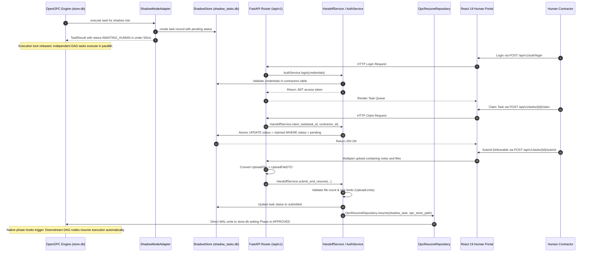
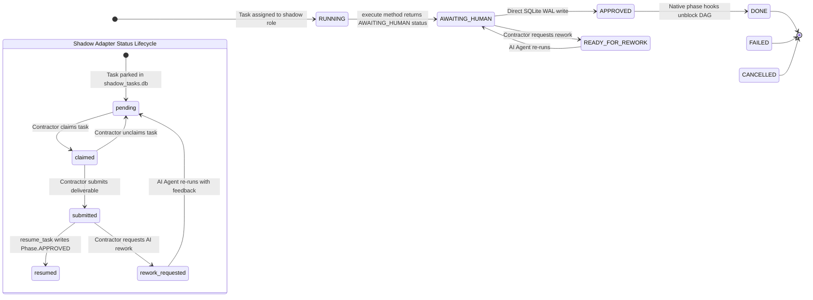
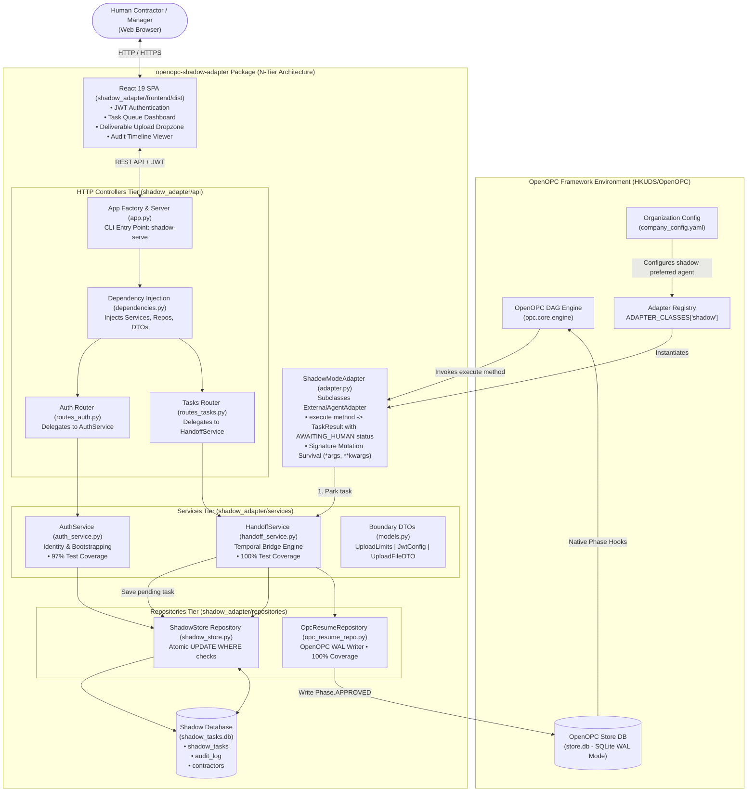

# OpenOPC-Shadow-Adapter — Technical Architecture Specification

This document defines the deep architectural specifications, data flows, state machine mechanics, and implementation contracts for `openopc-shadow-adapter`.

---

## 1. Core Architecture Contracts

### ExternalAgentAdapter Inheritance
- **Base Class:** `opc.layer3_agent.adapters.base.ExternalAgentAdapter`
- **Registry Injection:** `ADAPTER_CLASSES["shadow"] = ShadowModeAdapter`
- **Broker Intercept (`start_process` & `execute`):** `start_process()` and `execute()` save task state to `shadow_tasks.db` and return `TaskResult(status=AWAITING_HUMAN)` in **< 50ms**. Execution threads release immediately so parallel DAG tasks execute without timing out.
- **Company Mode Isolation Home:** Implements `agent_isolation_home_slug() → "shadow"` to satisfy OpenOPC ExternalAgentBroker isolation requirements in Company Mode.
- **Phase Hook Resume Pipeline:** `resume_task()` delegates to `OpcResumeRepository` which uses OpenOPC's `OPCStore` API (`update_delegation_work_item()`) to validate phase transitions (`validate_transition()`), set phase to `Phase.APPROVED`, and fire native phase transition hooks (`on_phase_transition()`).

### N-Tier Production Line Architecture
The codebase enforces strict tier boundaries across 3 decoupled layers:

1. **Controllers Tier (`shadow_adapter/api/routes_*.py`)**
   - Pure HTTP I/O, OpenAPI request parsing, file stream conversion to DTOs, and response formatting.
   - Zero business logic, zero SQL.

2. **Services Tier (`shadow_adapter/services/`)**
   - **`HandoffService` (The Temporal Bridge):** Orchestrates park, claim, unclaim, submit, and resume pipelines with 100% test coverage.
   - **`AuthService` (Carbon Employee Identity):** Manages login, contractor registration (with first-user admin bootstrapping), and profile management.
   - Boundary DTOs (`UploadLimits`, `JwtConfig`, `UploadFileDTO`) prevent God Object config coupling.
   - Pure Domain Exceptions (`TaskNotFoundError`, `TaskPermissionError`, `TaskNotClaimedError`, `InvalidCredentialsError`).

3. **Repository Tier (`shadow_adapter/repositories/` & `shadow_store.py`)**
   - **`OpcResumeRepository`:** OpenOPC `store.db` resume writer using `OPCStore` API with a direct WAL fallback, 100% test coverage, and Exception Black Hole protection.
   - **`ShadowStore`:** Thread-safe SQLite WAL repository for `shadow_tasks.db`.

---

## 2. Phase State Machine Contract

```text
RUNNING          -> AWAITING_HUMAN    (via execute() return value in < 50ms)
AWAITING_HUMAN   -> APPROVED          (via resume_task() WAL write upon contractor submission)
AWAITING_HUMAN   -> READY_FOR_REWORK  (via contractor rework request in portal)
READY_FOR_REWORK -> AWAITING_HUMAN    (via AI agent re-execution with feedback)
APPROVED         -> DONE              (via OpenOPC native phase hooks)
```

---

## 3. Technical Lifecycle & Sequence



---

## 4. State Machine Integration



---

## 5. System Architecture & Component Mapping



---

## 6. Database Schema Specification (`shadow_tasks.db`)

### `shadow_tasks` Table
- `id`: INTEGER PRIMARY KEY AUTOINCREMENT
- `opc_task_id`: TEXT UNIQUE NOT NULL
- `opc_session_id`: TEXT
- `title`: TEXT NOT NULL
- `brief_md`: TEXT NOT NULL
- `assigned_role`: TEXT NOT NULL
- `priority`: TEXT NOT NULL DEFAULT 'medium'
- `status`: TEXT NOT NULL DEFAULT 'pending'
- `claimed_by`: INTEGER FOREIGN KEY -> contractors(id)
- `parked_at`: TIMESTAMP DEFAULT CURRENT_TIMESTAMP
- `claimed_at`: TIMESTAMP
- `submitted_at`: TIMESTAMP
- `resumed_at`: TIMESTAMP
- `deliverable_text`: TEXT
- `deliverable_files_json`: TEXT

### `audit_log` Table
- `id`: INTEGER PRIMARY KEY AUTOINCREMENT
- `shadow_task_id`: INTEGER FOREIGN KEY -> shadow_tasks(id)
- `actor_id`: INTEGER FOREIGN KEY -> contractors(id)
- `action`: TEXT NOT NULL (parked, claimed, unclaimed, submitted, resumed, rework_requested)
- `details_json`: TEXT
- `created_at`: TIMESTAMP DEFAULT CURRENT_TIMESTAMP

### `contractors` Table
- `id`: INTEGER PRIMARY KEY AUTOINCREMENT
- `username`: TEXT UNIQUE NOT NULL
- `email`: TEXT UNIQUE NOT NULL
- `password_hash`: TEXT NOT NULL
- `role`: TEXT NOT NULL DEFAULT 'contractor'
- `is_active`: INTEGER DEFAULT 1
- `created_at`: TIMESTAMP DEFAULT CURRENT_TIMESTAMP
