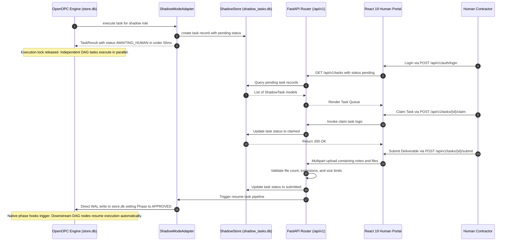
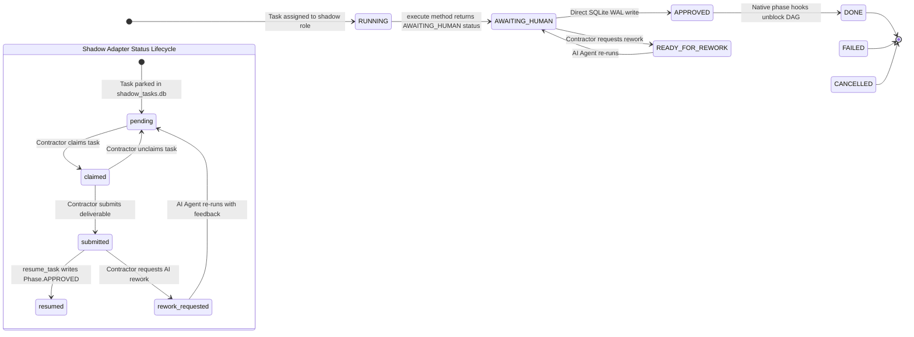
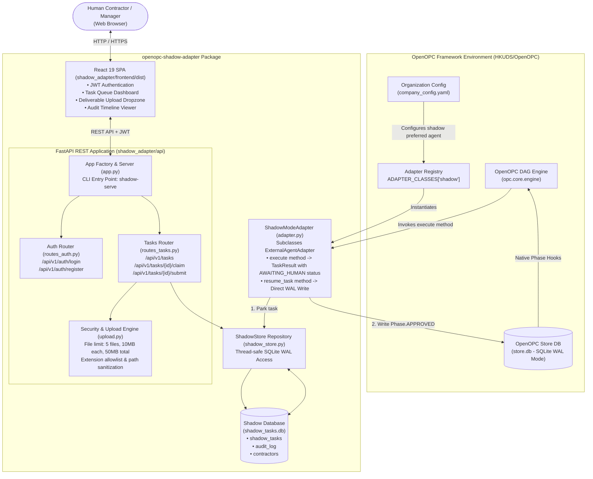

# OpenOPC-Shadow-Adapter — Technical Architecture Specification

This document defines the deep architectural specifications, data flows, state machine mechanics, and implementation contracts for `openopc-shadow-adapter`.

---

## 1. Core Architecture Contracts

### ExternalAgentAdapter Inheritance
- **Base Class:** `opc.layer3_agent.adapters.base.ExternalAgentAdapter`
- **Registry Injection:** `ADAPTER_CLASSES["shadow"] = ShadowModeAdapter`
- **Non-Blocking Intercept:** `execute()` MUST save task state to `shadow_tasks.db` and return `TaskResult(status=AWAITING_HUMAN)` in **< 50ms**. It MUST NOT block the calling engine execution thread.
- **WAL-Mode Resume Pipeline:** `resume_task()` MUST update OpenOPC's `store.db` setting task phase to `Phase.APPROVED` using SQLite Write-Ahead Logging (WAL mode) for safe concurrent database access.

---

## 2. Phase State Machine Contract

```text
RUNNING          -> AWAITING_HUMAN    (via execute() return value in < 50ms)
AWAITING_HUMAN   -> APPROVED          (via resume_task() WAL write upon contractor submission)
AWAITING_HUMAN   -> READY_FOR_REWORK  (via contractor rework request in portal)
READY_FOR_REWORK -> AWAITING_HUMAN    (via AI agent re-execution with feedback)
APPROVED         -> DONE              (via OpenOPC native phase hooks)
```

---

## 3. Technical Lifecycle & Sequence



---

## 4. State Machine Integration



---

## 5. System Architecture & Component Mapping



---

## 6. Database Schema Specification (`shadow_tasks.db`)

### `shadow_tasks` Table
- `id`: INTEGER PRIMARY KEY AUTOINCREMENT
- `opc_task_id`: TEXT UNIQUE NOT NULL
- `opc_session_id`: TEXT
- `title`: TEXT NOT NULL
- `brief_md`: TEXT NOT NULL
- `assigned_role`: TEXT NOT NULL
- `priority`: TEXT NOT NULL DEFAULT 'medium'
- `status`: TEXT NOT NULL DEFAULT 'pending'
- `claimed_by`: INTEGER FOREIGN KEY -> contractors(id)
- `parked_at`: TIMESTAMP DEFAULT CURRENT_TIMESTAMP
- `claimed_at`: TIMESTAMP
- `submitted_at`: TIMESTAMP
- `resumed_at`: TIMESTAMP
- `deliverable_text`: TEXT
- `deliverable_files_json`: TEXT

### `audit_log` Table
- `id`: INTEGER PRIMARY KEY AUTOINCREMENT
- `shadow_task_id`: INTEGER FOREIGN KEY -> shadow_tasks(id)
- `actor_id`: INTEGER FOREIGN KEY -> contractors(id)
- `action`: TEXT NOT NULL (parked, claimed, unclaimed, submitted, resumed, rework_requested)
- `details_json`: TEXT
- `created_at`: TIMESTAMP DEFAULT CURRENT_TIMESTAMP

### `contractors` Table
- `id`: INTEGER PRIMARY KEY AUTOINCREMENT
- `username`: TEXT UNIQUE NOT NULL
- `email`: TEXT UNIQUE NOT NULL
- `password_hash`: TEXT NOT NULL
- `role`: TEXT NOT NULL DEFAULT 'contractor'
- `is_active`: INTEGER DEFAULT 1
- `created_at`: TIMESTAMP DEFAULT CURRENT_TIMESTAMP
