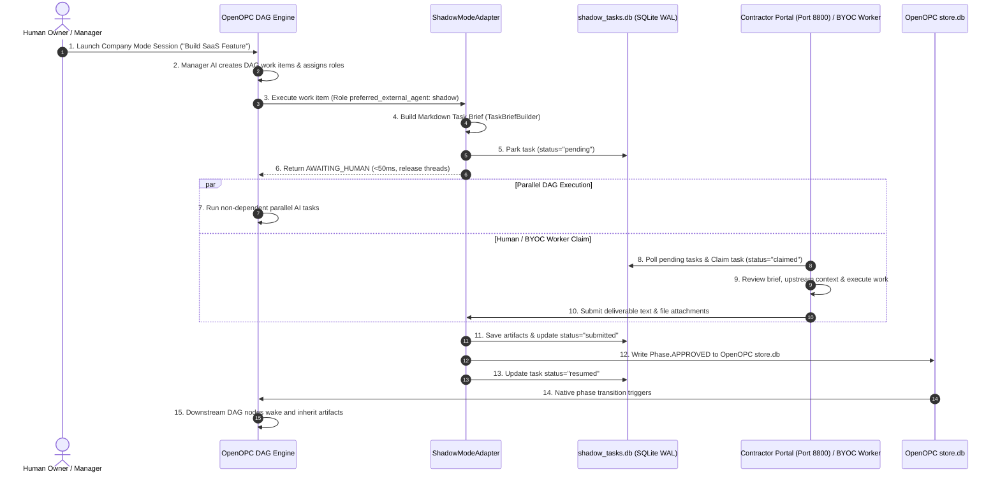

# The End-to-End Execution Flow (In a Nutshell)

This document provides a concise, step-by-step walkthrough of how tasks flow through OpenOPC when the `openopc-shadow-adapter` is active—from initial user prompt to DAG completion.

---

## High-Level Execution Flowchart



---

## Detailed Step-by-Step Breakdown

### Step 1: Session Initiation & DAG Generation
* **Who does this?** The Human Owner or Project Manager.
* **What happens?** The user launches an OpenOPC session:
  ```bash
  opc chat -p demo --mode company --company-profile corporate "Implement secure auth microservice"
  ```
* OpenOPC's Manager AI decomposes the goal into a Directed Acyclic Graph (DAG) of work items and assigns roles (e.g. `research_analyst`, `senior_developer`, `security_auditor`, `legal_counsel`).

---

### Step 2: Role Configuration & Intercept Trigger
* **Who does this?** Configured in `.opc/config/company_orgs/company_config.yaml`.
* **What happens?** When OpenOPC reaches a work item whose assigned role has `preferred_external_agent: shadow`:
  ```yaml
  roles:
    security_auditor:
      execution_strategy: external
      preferred_external_agent: shadow  # <-- Intercepted!
  ```
  OpenOPC invokes `ShadowModeAdapter.start_process()` (via `ExternalAgentBroker`).

---

### Step 3: Non-Blocking Task Parking (<50ms)
* **Who does this?** `ShadowModeAdapter` & `TaskBriefBuilder`.
* **What happens?**:
  1. The adapter extracts the task objective, project goal, and ancestor subagent deliverables.
  2. `TaskBriefBuilder` compiles a structured markdown brief (`brief_md`).
  3. The adapter parks a record into `shadow_tasks.db` with status `pending`.
  4. The adapter returns `AWAITING_HUMAN` status and a completed mock process to the OpenOPC broker.
  5. **Crucial Benefit**: Python execution threads release immediately. Non-dependent DAG branches continue running in parallel without stalling or timing out.

---

### Step 4: Worker Discovery & Claiming
* **Who does this?** Human Freelancers (Port 8800) or Remote BYOC Nodes (`shadow-worker`).
* **What happens?**:
  * **Option A (Human Freelancer via React Portal):**
    - Freelancer logs into `http://localhost:8800`.
    - Views pending tasks matching their assigned role.
    - Clicks **Claim Task**. Status transitions to `claimed`.
  * **Option B (Remote Silicon BYOC Node via CLI):**
    - A remote GPU workstation running `shadow-worker --role senior_developer --provider ollama` polls `/api/v1/tasks`.
    - Automatically claims the pending task.

---

### Step 5: Context Inspection & Work Execution
* **Who does this?** Contractor or Silicon Worker.
* **What happens?**:
  - The worker opens `TaskWorkspace`.
  - Reads the rendered markdown specification (`brief_md`).
  - Downloads upstream subagent deliverables (e.g. previous specification docs, code files, CSVs) indexed in `CorporateArtifacts`.
  - Executes the required coding, auditing, or drafting work.

---

### Step 6: Deliverable Submission & Handoff
* **Who does this?** Worker & `HandoffService`.
* **What happens?**:
  - Worker writes deliverable notes/code summary and attaches up to 5 files (total payload $\le$ 50MB).
  - Clicks **Submit Deliverable & Resume DAG**.
  - `HandoffService` validates payload limits, stores files in `shadow_uploads/`, and indexes records into `CorporateArtifacts` with SHA-256 hashes.
  - Task status transitions to `submitted`.

---

### Step 7: Canonical State Resume & DAG Unblock
* **Who does this?** `OpcResumeRepository` & OpenOPC Engine.
* **What happens?**:
  1. `OpcResumeRepository` initializes OpenOPC's `OPCStore` API against `store.db`.
  2. Calls `store.update_delegation_work_item(phase=target_phase)` which validates transitions (`validate_transition()`) and triggers native `on_phase_transition()` hooks (`task.status` sync, dispatcher wake signals).
  3. Updates shadow task status to `resumed`.
  4. OpenOPC's engine detects the phase transition, wakes downstream DAG nodes, and passes `CorporateArtifacts` context to successor roles.
  5. The Contractor Portal displays the **Ghost Submission Lock Screen**: *"Deliverable Submitted. The OpenOPC DAG has automatically resumed."*
