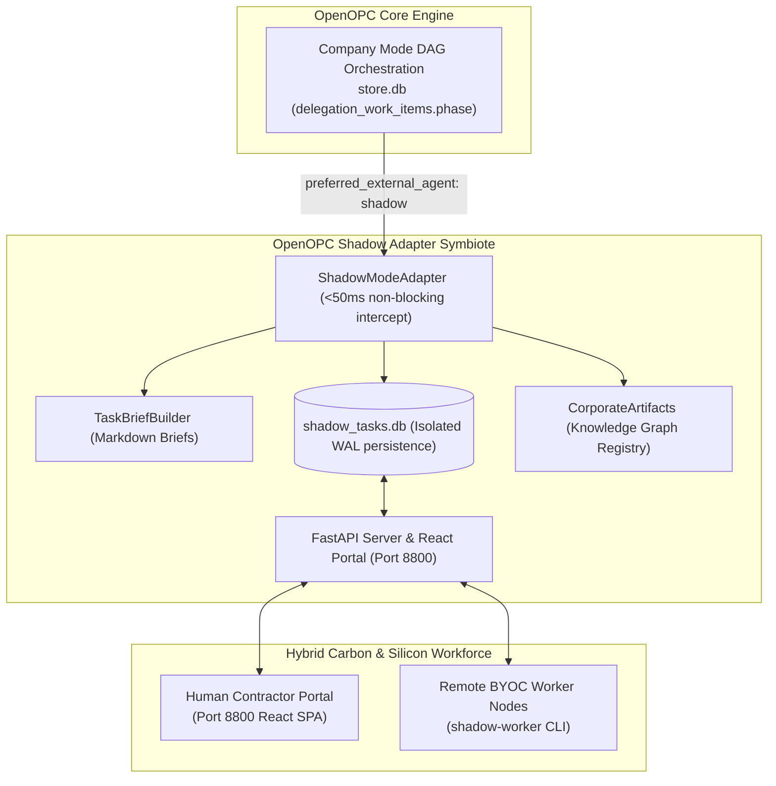

# OpenOPC Shadow Adapter: Implementation & Setup Guide

This guide provides step-by-step setup, configuration, and architectural walkthrough instructions for integrating `openopc-shadow-adapter` into your OpenOPC deployment.

---

## 1. Architecture Overview

`openopc-shadow-adapter` is a decoupled, zero-core-modification extension for OpenOPC.



---

## 2. Installation & Quick Setup Walkthrough

### Step 1: Install Package
Install `openopc-shadow-adapter` in your OpenOPC Python environment:

```bash
pip install openopc-shadow-adapter
```

### Step 2: Configure Target Roles in OpenOPC
Edit your OpenOPC organization profile (e.g. `.opc/config/company_orgs/company_config.yaml`):

```yaml
roles:
  senior_developer:
    title: "Senior Developer (Hybrid Seat)"
    execution_strategy: external
    preferred_external_agent: shadow  # <-- Intercepted by Shadow Adapter

  legal_counsel:
    title: "Human Legal Counsel"
    execution_strategy: external
    preferred_external_agent: shadow  # <-- Intercepted by Shadow Adapter
```

---

## 3. Server Deployment Options

### Option A: Embedded Launch (Single Process)
Add two lines to your main OpenOPC application script (e.g., `main.py`):

```python
from opc.layer3_agent.adapters.registry import ADAPTER_CLASSES
from shadow_adapter import ShadowModeAdapter, start_server_in_thread

# 1. Register shadow mode into OpenOPC registry
ADAPTER_CLASSES["shadow"] = ShadowModeAdapter

# 2. Start Contractor Portal REST server in background thread
start_server_in_thread(port=8800)

# 3. Launch OpenOPC DAG pipeline as normal
```

### Option B: Standalone CLI Server (`shadow-serve`)
Run the portal server as a separate process or Docker container:

```bash
shadow-serve --port 8800 --db ./shadow_tasks.db
```

* **React Contractor Portal:** `http://localhost:8800`
* **REST API Base:** `http://localhost:8800/api/v1`

---

## 4. Contractor & BYOC Workforce Setup

### Human Contractor Setup (Port 8800)
1. Open `http://localhost:8800` in browser.
2. Register/Login as a contractor.
3. Claim pending tasks assigned to your role.
4. View markdown brief, download upstream deliverables, and submit work.

### Distributed Silicon BYOC Worker Setup
Launch remote compute nodes on dedicated GPU servers or laptops:

```bash
# GPU Node running local Llama 3.3 via Ollama
shadow-worker \
  --server-url "http://<openopc-host>:8800" \
  --username "gpu_node_01" \
  --password "password123" \
  --role "senior_developer" \
  --provider "ollama" \
  --model "llama3.3:70b"

# Remote Compliance Node using Claude 3.5 Sonnet
shadow-worker \
  --server-url "http://<openopc-host>:8800" \
  --username "legal_node_02" \
  --password "password123" \
  --role "legal_counsel" \
  --provider "anthropic" \
  --model "claude-3-5-sonnet-20241022"
```

---

## 5. Security & Safety Verification

### Environment Configuration Variables

| Variable | Default Value | Description |
|---|---|---|
| `SHADOW_JWT_SECRET` | System Generated | Secret key for signing JWT tokens. |
| `SHADOW_DB_PATH` | `./shadow_tasks.db` | SQLite database path for shadow tasks. |
| `SHADOW_OPC_STORE_PATH` | `.opc/projects/default/store.db` | Path to OpenOPC `store.db` for WAL resume writes. |
| `SHADOW_UPLOAD_DIR` | `./shadow_uploads` | Storage path for deliverable file attachments. |
| `SHADOW_MAX_FILES_PER_SUBMISSION` | `5` | Max allowed files per submission. |
| `SHADOW_MAX_FILE_SIZE_MB` | `10` | Max allowed size per file in MB. |
| `SHADOW_MAX_TOTAL_UPLOAD_SIZE_MB` | `50` | Max total payload cap per submission in MB. |

### Test Suite Execution
Run the full automated test suite (64 tests) to verify system integrity:

```bash
pytest tests/ -v --cov=shadow_adapter
```
