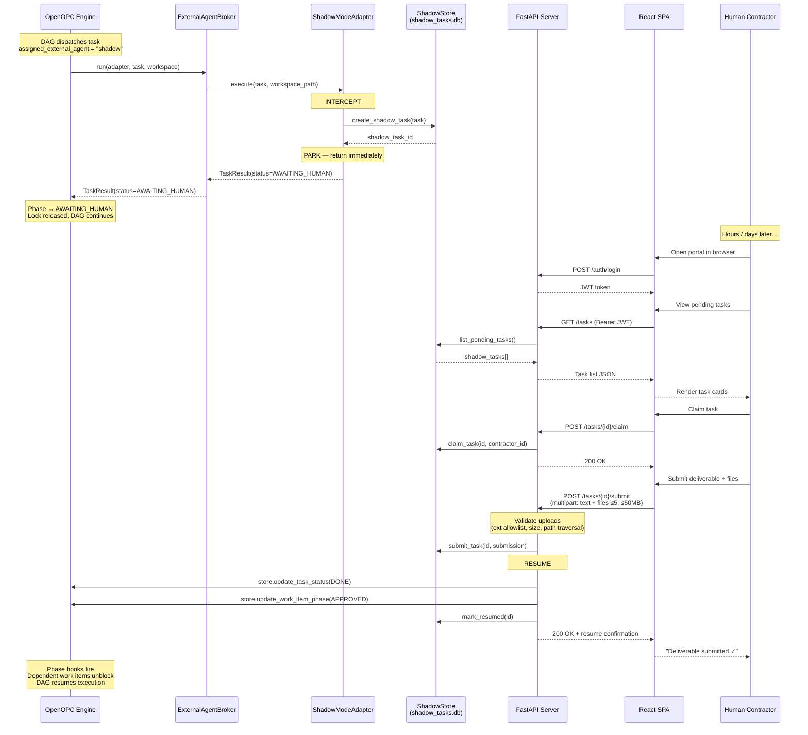

# openopc-shadow-adapter — Architectural Design Document (FINALIZED)

> **Phase 1: Design & Planning — FINAL**
> All open questions resolved. Approved decisions locked in.

---

## Approved Architectural Decisions

| Decision | Resolution |
|---|---|
| **Adapter Registration** | ✅ Option A — Programmatic injection: `ADAPTER_CLASSES["shadow"] = ShadowModeAdapter` before engine init |
| **Resume Callback** | ✅ Direct SQLite access via `SHADOW_OPC_STORE_PATH` using WAL mode. DB existence verified on startup. |
| **Human Portal** | ✅ **React + Tailwind CSS SPA** — NO Streamlit. Production build served statically from FastAPI. Maintains visual/technical coherence with OpenOPC's `office_ui`. |
| **Webhook Callbacks** | ❌ **Out of scope for V1.** Direct REST API submission only. |
| **File Upload Limits** | ✅ **5 files max** per submission, **50MB total payload**, **10MB max per individual file**. |

---

## 1. Component Topology

### 1.1 Package Structure

```
openopc-shadow-adapter/
├── pyproject.toml                      # Standalone package, opc as optional dep
├── README.md
├── .env.example
├── shadow_adapter/
│   ├── __init__.py
│   ├── adapter.py                      # ShadowModeAdapter (ExternalAgentAdapter)
│   ├── shadow_store.py                 # Isolated SQLite CRUD
│   ├── models.py                       # Pydantic v2 data models
│   ├── config.py                       # pydantic-settings env var config
│   ├── security.py                     # JWT auth + bcrypt passwords
│   ├── upload.py                       # Secure file upload handler
│   ├── api/
│   │   ├── __init__.py
│   │   ├── app.py                      # FastAPI factory + static file serving
│   │   ├── routes_auth.py              # POST /auth/login, /auth/register
│   │   ├── routes_tasks.py             # GET /tasks, POST /tasks/{id}/submit
│   │   └── dependencies.py             # JWT verification, DB injection
│   └── frontend/                       # React + Tailwind SPA
│       ├── package.json
│       ├── vite.config.ts
│       ├── tailwind.config.js
│       ├── tsconfig.json
│       ├── index.html
│       ├── src/
│       │   ├── main.tsx                # React entry point
│       │   ├── App.tsx                 # Root with routing
│       │   ├── index.css               # Tailwind + OpenOPC design tokens
│       │   ├── api/
│       │   │   └── client.ts           # API client (fetch wrapper + JWT)
│       │   ├── components/
│       │   │   ├── Layout.tsx          # Shell with nav, matches OpenOPC aesthetic
│       │   │   ├── TaskCard.tsx        # Task list card with status badge
│       │   │   ├── TaskDetail.tsx      # Full task view + submission form
│       │   │   ├── FileUpload.tsx      # Drag-drop multi-file upload
│       │   │   ├── StatusBadge.tsx     # Colored status indicators
│       │   │   └── ProtectedRoute.tsx  # JWT route guard
│       │   ├── pages/
│       │   │   ├── LoginPage.tsx
│       │   │   ├── DashboardPage.tsx
│       │   │   ├── TaskListPage.tsx
│       │   │   └── TaskDetailPage.tsx
│       │   ├── stores/
│       │   │   └── authStore.ts        # JWT token + user state
│       │   └── types/
│       │       └── index.ts            # TypeScript interfaces
│       └── dist/                       # Production build output (served by FastAPI)
├── tests/
│   ├── conftest.py
│   ├── mock_openopc_engine.py
│   ├── test_adapter.py
│   ├── test_shadow_store.py
│   ├── test_api.py
│   └── test_security.py
├── example_usage.py
└── docs/
    └── phases/
        ├── PHASE_2_CORE_BACKEND.md
        ├── PHASE_3_API_AND_UI.md
        ├── PHASE_4_TESTING.md
        └── PHASE_5_PACKAGING.md
```

### 1.2 Component Responsibilities

| Component | Responsibility |
|---|---|
| **`ShadowModeAdapter`** | Implements [`ExternalAgentAdapter`](file:///home/leech/Projects/OpenOPC/opc/layer3_agent/adapters/base.py#L92) ABC. Intercepts tasks, parks them in shadow DB, returns `AWAITING_HUMAN` immediately. |
| **`ShadowStore`** | Owns `shadow_tasks.db` (SQLite WAL). Fully isolated from OpenOPC's [`OPCStore`](file:///home/leech/Projects/OpenOPC/opc/database/store.py). Tracks shadow task lifecycle with audit log. |
| **`FastAPI Server`** | Headless REST API for contractors. JWT-protected. Serves the React SPA's production build as static files. |
| **`React + Tailwind SPA`** | Human Portal frontend. Built with Vite, styled with Tailwind CSS using OpenOPC's design tokens (`--bg: #0c111b`, `--accent: #6366f1`, etc.). Production build output in `frontend/dist/`, served by FastAPI. |
| **`Security Module`** | JWT issuance/verification (HS256). bcrypt password hashing. File upload path traversal protection. |

### 1.3 Frontend Design Coherence with OpenOPC

The React SPA inherits OpenOPC's visual language from [`index.css`](file:///home/leech/Projects/OpenOPC/opc/plugins/office_ui/frontend_src/index.css#L8-L56):

| OpenOPC Design Token | Value | Usage in Shadow Portal |
|---|---|---|
| `--bg` | `#0c111b` | Page background |
| `--bg-elevated` | `#141b2b` | Card backgrounds |
| `--text` | `#e2e8f0` | Primary text |
| `--text-secondary` | `#8494a7` | Muted text |
| `--accent` | `#6366f1` | Buttons, links, active states |
| `--accent-soft` | `rgba(99, 102, 241, 0.15)` | Hover backgrounds |
| `--border` | `rgba(148, 163, 184, 0.12)` | Borders |
| `--green` | `#34d399` | Success / "Resumed" status |
| `--yellow` | `#fbbf24` | Warning / "Claimed" status |
| `--red` | `#f87171` | Error / "Failed" status |
| `--radius` | `12px` | Card border radius |
| Font family | `'Inter', 'SF Pro Display', …` | All text |

Tailwind is configured to use these same tokens via `tailwind.config.js` `extend.colors`, ensuring pixel-level visual parity with the main OpenOPC UI.

---

## 2. Data Contract Mapping

### 2.1 OpenOPC Task → ShadowTask

When the adapter receives an OpenOPC [`Task`](file:///home/leech/Projects/OpenOPC/opc/core/models.py#L338-L365), it extracts a `ShadowTask` for isolated storage:

| OpenOPC `Task` Field | ShadowTask Field | Notes |
|---|---|---|
| `id` | `opc_task_id` | Original task UUID preserved for resume |
| `session_id` | `opc_session_id` | Session provenance |
| `title` | `title` | Direct copy |
| `description` | `description` | Full task prompt/brief |
| `assigned_to` | `assigned_role` | Role that owns this work |
| `status` | *(set to AWAITING_HUMAN)* | We control OpenOPC's status |
| `priority` | `priority` | Integer priority |
| `project_id` | `opc_project_id` | Project scope |
| `metadata` | `opc_metadata` | Full metadata snapshot (JSON) |
| `linked_work_item_id` | `opc_work_item_id` | Work item for phase transitions |

### 2.2 Human Output → OpenOPC TaskResult

```python
def shadow_submission_to_task_result(shadow_task: ShadowTask) -> TaskResult:
    return TaskResult(
        status=TaskStatus.DONE,
        content=shadow_task.deliverable_text or "",
        artifacts={
            "shadow_task_id": shadow_task.id,
            "deliverable_files": shadow_task.deliverable_files,
            "contractor_id": shadow_task.assigned_contractor_id,
            "submitted_at": shadow_task.submitted_at.isoformat() if shadow_task.submitted_at else "",
            "source": "human_shadow_adapter",
        },
        cost=0.0,
        token_usage={},
    )
```

---

## 3. State Management & Timeout Strategy

### 3.1 The Strategy: Non-Blocking Execute + Direct Resume

Our adapter **does not block inside `execute()`**. Instead:

1. **`execute()` returns immediately** with `TaskResult(status=TaskStatus.AWAITING_HUMAN)`. This is a valid OpenOPC status ([`TaskStatus.AWAITING_HUMAN`](file:///home/leech/Projects/OpenOPC/opc/core/models.py#L103)) and a valid phase transition target ([`Phase.AWAITING_HUMAN`](file:///home/leech/Projects/OpenOPC/opc/layer2_organization/phase.py#L134)).

2. The task transitions to **`Phase.AWAITING_HUMAN`** in OpenOPC's state machine. This phase is in [`IN_REVIEW_PHASES`](file:///home/leech/Projects/OpenOPC/opc/layer2_organization/phase.py#L195-L198):
   - Execution lock released
   - NOT runnable (no agent steals it)
   - NOT terminal (has valid exits: `APPROVED`, `READY_FOR_REWORK`, `FAILED`, `CANCELLED`)
   - Other DAG branches continue executing

3. **When the human submits** via `POST /tasks/{id}/submit`, the API triggers the resume pipeline:
   - Constructs `TaskResult(status=DONE)` from the submission
   - Updates OpenOPC's task status to `DONE` and work item phase to `APPROVED`
   - Phase transition hooks fire on next engine tick, unblocking dependent work items

### 3.2 Timeout Avoidance

| OpenOPC Timeout | How We Avoid It |
|---|---|
| `idle_timeout_seconds` (900s) | No subprocess — `execute()` returns immediately |
| `startup_timeout_seconds` | No subprocess startup |
| `execution_lock` lease | Lock released after parking |
| `EscalationEngine` timeout (300s) | We return `AWAITING_HUMAN` directly, don't use escalation |

### 3.3 Phase Transition Map

```
RUNNING → adapter.execute() → TaskResult(AWAITING_HUMAN)
    │
    ▼
AWAITING_HUMAN  (hours/days pass — DAG continues elsewhere)
    │
    ├──→ APPROVED          (human submits deliverable)
    ├──→ READY_FOR_REWORK  (human rejects / needs changes)
    ├──→ FAILED            (error in resume pipeline)
    └──→ CANCELLED         (admin cancels)
```

Transitions allowed by OpenOPC's [phase table](file:///home/leech/Projects/OpenOPC/opc/layer2_organization/phase.py#L291-L294):
```python
Phase.AWAITING_HUMAN: frozenset({Phase.APPROVED, Phase.READY_FOR_REWORK}) | _UNIVERSAL_EXITS | _RECOVERY_EXITS
```

---

## 4. Sequence Diagram



---

## 5. Database Schema (shadow_tasks.db)

### 5.1 `shadow_tasks` Table

```sql
CREATE TABLE IF NOT EXISTS shadow_tasks (
    id                    TEXT PRIMARY KEY,
    opc_task_id           TEXT NOT NULL,
    opc_session_id        TEXT,
    opc_project_id        TEXT NOT NULL DEFAULT 'default',
    opc_work_item_id      TEXT DEFAULT '',
    opc_metadata_json     TEXT DEFAULT '{}',

    title                 TEXT NOT NULL,
    description           TEXT DEFAULT '',
    assigned_role         TEXT DEFAULT '',
    priority              INTEGER DEFAULT 5,

    status                TEXT NOT NULL DEFAULT 'pending'
                          CHECK(status IN ('pending','claimed','submitted','resumed','failed','cancelled')),
    assigned_contractor_id TEXT,

    deliverable_text      TEXT,
    deliverable_files_json TEXT DEFAULT '[]',

    parked_at             TEXT NOT NULL,
    claimed_at            TEXT,
    submitted_at          TEXT,
    resumed_at            TEXT,
    deadline              TEXT,

    extra_metadata_json   TEXT DEFAULT '{}',

    created_at            TEXT NOT NULL DEFAULT (datetime('now')),
    updated_at            TEXT NOT NULL DEFAULT (datetime('now'))
);
```

### 5.2 `shadow_contractors` Table

```sql
CREATE TABLE IF NOT EXISTS shadow_contractors (
    id            TEXT PRIMARY KEY,
    username      TEXT NOT NULL UNIQUE,
    email         TEXT,
    password_hash TEXT NOT NULL,
    display_name  TEXT DEFAULT '',
    roles_json    TEXT DEFAULT '["contractor"]',
    is_active     INTEGER DEFAULT 1,
    created_at    TEXT NOT NULL DEFAULT (datetime('now')),
    updated_at    TEXT NOT NULL DEFAULT (datetime('now'))
);
```

### 5.3 `shadow_audit_log` Table

```sql
CREATE TABLE IF NOT EXISTS shadow_audit_log (
    id            INTEGER PRIMARY KEY AUTOINCREMENT,
    shadow_task_id TEXT NOT NULL,
    actor_id      TEXT,
    action        TEXT NOT NULL,
    details_json  TEXT DEFAULT '{}',
    created_at    TEXT NOT NULL DEFAULT (datetime('now')),
    FOREIGN KEY (shadow_task_id) REFERENCES shadow_tasks(id)
);
```

---

## 6. API Contract

### 6.1 Authentication

| Endpoint | Method | Auth | Description |
|---|---|---|---|
| `/auth/login` | POST | None | Issue JWT for contractor |
| `/auth/register` | POST | Admin JWT | Create new contractor account |
| `/auth/me` | GET | JWT | Get current contractor profile |

### 6.2 Task Operations

| Endpoint | Method | Auth | Description |
|---|---|---|---|
| `/tasks` | GET | JWT | List tasks (filter: `status`, `assigned_to_me`, `limit`, `offset`) |
| `/tasks/{id}` | GET | JWT | Full task detail with context + audit log |
| `/tasks/{id}/claim` | POST | JWT | Claim a pending task |
| `/tasks/{id}/unclaim` | POST | JWT | Release a claimed task |
| `/tasks/{id}/submit` | POST | JWT | Submit deliverable (multipart). **≤5 files, ≤50MB total, ≤10MB each**. Triggers OpenOPC resume. |
| `/tasks/{id}/audit` | GET | JWT | Audit trail for a task |
| `/health` | GET | None | Health check |

### 6.3 Upload Constraints (Enforced)

| Constraint | Value |
|---|---|
| Max files per submission | **5** |
| Max total payload | **50MB** |
| Max per-file size | **10MB** |
| Allowed extensions | `.pdf, .docx, .xlsx, .pptx, .txt, .md, .png, .jpg, .jpeg, .zip, .tar.gz` |
| Filename sanitization | UUID prefix, path separators stripped, `..` removed |

---

## 7. Security Architecture

### 7.1 JWT Authentication
- **Algorithm:** HS256 with `SHADOW_JWT_SECRET`
- **Token lifetime:** 24 hours (configurable)
- **Payload:** `{ "sub": contractor_id, "username": "...", "roles": [...], "exp": ..., "iat": ... }`
- **Password storage:** bcrypt with auto-salt via `passlib`
- **Bootstrap:** First registered user gets `admin` role automatically

### 7.2 File Upload Security

| Threat | Mitigation |
|---|---|
| Path traversal | Files renamed to `{uuid}_{sanitized_basename}`. All `/`, `\`, `..` stripped. Flat storage per task. |
| Oversized uploads | Streaming size check — never loads full file into memory. 10MB per file, 50MB total. |
| Malicious types | Extension allowlist enforced server-side. |
| Filename injection | Non-alphanumeric chars (except `-`, `_`, `.`) stripped. |

---

## 8. React SPA Architecture

### 8.1 Tech Stack (Coherent with OpenOPC)

| Technology | Version | Rationale |
|---|---|---|
| React | 19.x | Same as OpenOPC's [`office_ui`](file:///home/leech/Projects/OpenOPC/opc/plugins/office_ui/frontend_src/package.json#L19) |
| Vite | 7.x | Same build tool as OpenOPC |
| TypeScript | 5.x | Same as OpenOPC |
| Tailwind CSS | 4.x | Configured with OpenOPC design tokens for visual parity |

### 8.2 Pages

| Page | Route | Description |
|---|---|---|
| Login | `/login` | Username/password form. JWT stored in localStorage. |
| Dashboard | `/` | Summary cards: pending, claimed, submitted, resumed counts. |
| Task List | `/tasks` | Filterable/sortable table. Status badges. Claim button. |
| Task Detail | `/tasks/:id` | Full task brief, OPC metadata, submission form with drag-drop file upload. |

### 8.3 Static Serving from FastAPI

The production build (`npm run build` → `frontend/dist/`) is served by FastAPI:

```python
# In api/app.py
app.mount("/", StaticFiles(directory="frontend/dist", html=True), name="spa")
```

API routes are prefixed with `/api/` to avoid collision:
- `/api/auth/login`
- `/api/tasks`
- `/api/tasks/{id}/submit`
- `/api/health`

The SPA's `vite.config.ts` proxies `/api` to the FastAPI backend during development.

---

## 9. Integration Blueprint

### 9.1 Installation

```bash
pip install openopc-shadow-adapter
```

### 9.2 Register in `agent_config.yaml`

```yaml
external_agents:
  preferred_order:
    - claude_code
    - codex
    - cursor
    - opencode
    - shadow

  shadow:
    enabled: true
    command: ""
    run_mode: batch
    idle_timeout_seconds: 0
    approval_mode: full-auto
```

### 9.3 Programmatic Registration

```python
from opc.layer3_agent.adapters.registry import ADAPTER_CLASSES
from shadow_adapter.adapter import ShadowModeAdapter
ADAPTER_CLASSES["shadow"] = ShadowModeAdapter
```

### 9.4 Environment Variables

```bash
SHADOW_JWT_SECRET="your-secure-secret"          # Required
SHADOW_DB_PATH="./shadow_tasks.db"              # Default
SHADOW_OPC_STORE_PATH=".opc/projects/default/store.db"
SHADOW_UPLOAD_DIR="./shadow_uploads"
SHADOW_MAX_UPLOAD_SIZE_MB="50"
SHADOW_MAX_FILE_SIZE_MB="10"
SHADOW_MAX_FILES_PER_SUBMISSION="5"
SHADOW_API_PORT="8800"
```

### 9.5 Start the Server

```bash
shadow-serve --port 8800
# or
python -m shadow_adapter.api.app --port 8800
```

### 9.6 Assign a Role

```yaml
roles:
  human_reviewer:
    title: "Human QA Reviewer"
    execution_strategy: external
    preferred_external_agent: shadow
```

Or Task Mode: `opc chat -p demo --mode task --agent shadow "Review this document"`

---

## 10. Verification Plan

### 10.1 Automated Tests
```bash
pytest tests/ -v
```

### 10.2 Integration Mock
`mock_openopc_engine.py` simulates full lifecycle: dispatch → park → submit → resume → DAG unblock.

### 10.3 Manual Verification
- Start shadow server → open React portal in browser
- Login as contractor → view parked tasks → claim → upload files → submit
- Verify OpenOPC store reflects `DONE` status and `APPROVED` phase
